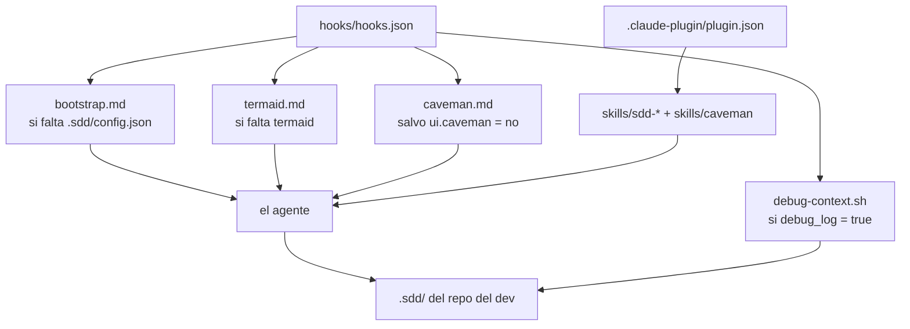

# C4 — Nivel 3: Componentes

> Repo de **un solo módulo**: el detalle vive acá, sin `CLAUDE.md` anidados (BR-089). Sin código: markdown y JSON (ADR-0016).

## Qué hay y dónde

| Componente | Ruta | Qué hace |
|---|---|---|
| Manifiesto | `.claude-plugin/plugin.json` | Identidad del plugin. **No declara `skills` ni `hooks`**: se cargan por convención y declararlos los duplica |
| Marketplace | `.claude-plugin/marketplace.json` | Hace el repo instalable por terceros (`source: "./"`) |
| Arranque | `hooks/hooks.json` | Cuatro hooks `SessionStart` (los dos primeros mutuamente excluyentes, el tercero y el cuarto independientes) más `PreToolUse`/`Task`, `SubagentStop` y `SessionEnd` |
| ↳ repo sin configurar | `hooks/bootstrap.md` | Se vuelca si falta `.sdd/config.json`: ofrece configurar e invoca `sdd-bootstrap` (BR-080) |
| ↳ termaid ausente | `hooks/termaid.md` | Se vuelca si el repo YA está configurado y no hay respuesta en `ui.termaid` (BR-087) |
| ↳ estilo caveman | `hooks/caveman.md` | Se vuelca SIEMPRE salvo `ui.caveman` en `'no'`: activo por default (BR-091) |
| ↳ medición de contexto | `hooks/debug-context.sh` | Único ejecutable del plugin desde ADR-0016 (ADR-0018): con `debug_log: true` en `.sdd/config.json`, escribe inicio/fin de contexto por agente. POSIX `sh`, silencioso siempre |
| Configuración del repo | `skills/sdd-bootstrap/` | Investiga, pregunta y escribe `.sdd/` la primera vez. Fuera del flujo de tareas: la invoca el hook (BR-092) |
| Router del flujo | `skills/sdd-task/SKILL.md` | Captura, clasifica y decide profundidad por riesgo (BR-057, BR-058) |
| ↳ formato de artefactos | `skills/sdd-task/references/artefactos.md` | **Fuente única**: índice, estados, gates, volcado en terminal, termaid |
| ↳ estructura del C4 | `skills/sdd-task/references/estructura-c4.md` | Formato máquina, índice vs detalle, frontera capa/módulo (BR-088 a BR-090) |
| Fases | `skills/sdd-{analyze,specify,plan,execute,close}/` | Un `SKILL.md` por fase + sus templates y ejemplos |
| Templates | `skills/sdd-analyze/templates/analysis.md`, `skills/sdd-specify/templates/spec.md`, `skills/sdd-plan/templates/{plan,design}.md` | Los 4 artefactos vigentes |
| Mejora de skills | `skills/sdd-improve-skill/SKILL.md` | Auditoría de una skill contra las best practices |
| Estilo de respuesta | `skills/caveman/SKILL.md` | Reglas de compresión del chat con el dev. Única skill fuera del flujo: sin prefijo `sdd-` (BR-091) |

## Cómo se conecta

**No hay runtime nueva** (ADR-0018 no suma Node/jq/Python): la mayoría de los hooks vuelca markdown, salvo `debug-context.sh`, que corre lógica POSIX real. Fuera de eso, el agente es el único intérprete del flujo, y por eso ninguna otra garantía es determinística (ADR-0016).

## ❓ VALIDAR con el equipo

- [ ] ¿Las 7 skills `sdd-*` son la partición correcta del flujo, o hay una que siempre se lee junto con otra?

<!-- sdd:manual — todo lo que está debajo de esta línea se preserva en regeneraciones -->

## Notas del equipo

_(esta sección no se pisa al regenerar)_
