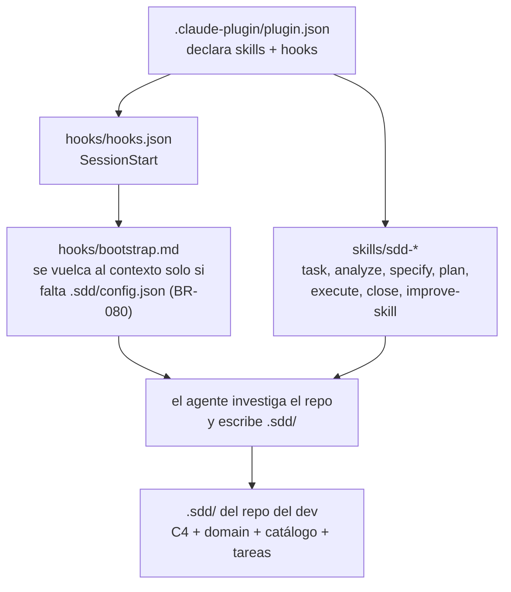
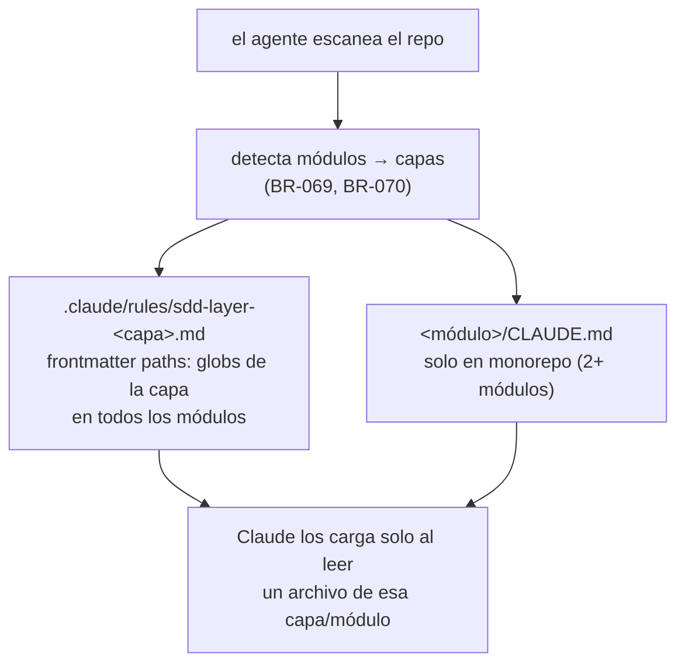

# C4 — Nivel 3: Componentes

> Actualizado a mano en la tarea 020 (2026-08-11). Base: la raíz del repo. **Este repo ya no tiene código**: es un plugin de Claude Code hecho de markdown y JSON (ADR-0016).

| Módulo | Contenido | Rol |
|---|---|---|
| `.claude-plugin/` | `plugin.json`, `marketplace.json` | Manifiesto del plugin y marketplace propio: qué se instala y de dónde |
| `skills/` | 7 skills `sdd-*`, cada una con `SKILL.md` + `references/`, `templates/`, `examples/` | El comportamiento: lo que el agente lee y ejecuta en cada fase del flujo SDD |
| `hooks/` | `hooks.json`, `bootstrap.md` | Único disparo automático: el `SessionStart` que detecta un repo sin configurar |
| `.sdd/` | C4, `domain.md`, ADRs, catálogo, tareas, LEARNINGS | Estado del propio repo como usuario de sddkit (dogfooding), no parte del plugin |

**No hay proceso, binario ni runtime**: nada se ejecuta salvo el one-liner del hook. El agente es el único intérprete, y por eso ninguna garantía del flujo es determinística (ADR-0016).

## Documentación que el agente genera fuera de `.sdd/` (ADR-0015)

Al configurar o re-escanear un repo, el agente escribe también los docs que Claude Code carga bajo demanda (BR-069 a BR-074):

El bloque gestionado de la raíz declara dónde viven (BR-077); una rule cuyo glob no matchea nada está muerta y el agente lo avisa al tocarla (BR-076).

## ❓ VALIDAR con el equipo

- [ ] ¿Las 7 skills son la partición correcta del flujo, o hay una que siempre se lee junto con otra?

<!-- sdd:manual — todo lo que está debajo de esta línea se preserva en regeneraciones -->

## Notas del equipo

_(esta sección no se pisa al regenerar)_
