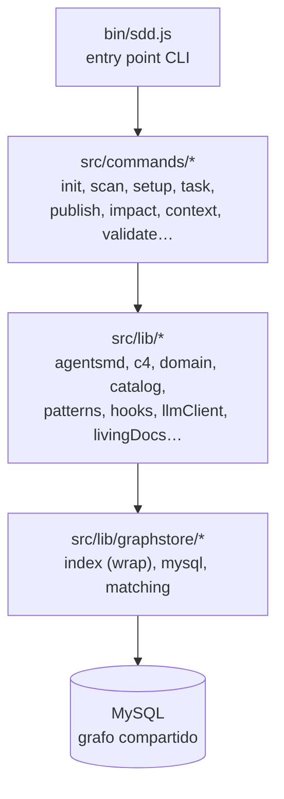

# C4 — Nivel 3: Componentes

> Generado por sddkit el 2026-06-15. Base: `src`.

| Módulo | Archivos | Rol |
|---|---|---|
| `src/lib` | 24 | Librería interna |
| `src/commands` | 24 | Comandos |
| `(raíz)` | 3 | ❓ por validar |

## ❓ VALIDAR con el equipo

- [ ] ¿Cuál es el rol del módulo `(raíz)`?

<!-- sdd:manual — todo lo que está debajo de esta línea se preserva en regeneraciones -->

## Notas del equipo

_(esta sección no se pisa al regenerar)_
