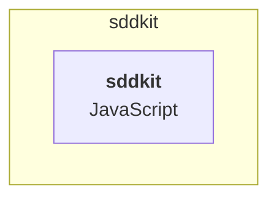

# C4 — Nivel 2: Contenedores

> Generado por sddkit el 2026-06-15.

| Contenedor | Tecnología | Responsabilidad |
|---|---|---|
| `sddkit` | JavaScript | ❓ responsabilidad por validar |

## Dependencias salientes

| Método | Destino | Archivo |
|---|---|---|
| ? | (dynamic) | src/lib/patterns.js |
| GET | (dynamic) | src/lib/patterns.js |

## ❓ VALIDAR con el equipo

- [ ] ¿Las responsabilidades de cada contenedor son correctas?
- [ ] ¿Falta algún contenedor que no se deduce del repo (workers, crons, lambdas)?

<!-- sdd:manual — todo lo que está debajo de esta línea se preserva en regeneraciones -->

## Notas del equipo

_(esta sección no se pisa al regenerar)_
