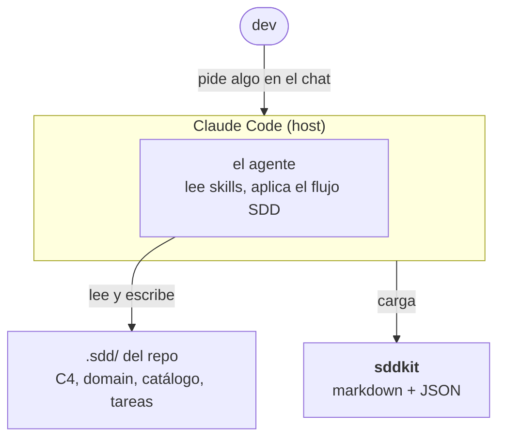

# C4 — Nivel 2: Contenedores

> Actualizado a mano en la tarea 020 (2026-08-11).

| Contenedor | Tecnología | Responsabilidad |
|---|---|---|
| `sddkit (plugin)` | Markdown + JSON, sin runtime | Todo el sistema: skills que el agente lee, manifiesto que las declara y un hook de arranque. Se instala desde el marketplace del repo; no requiere Node ni instalación manual (BR-079) |
| `Claude Code` | Host del plugin | El único ejecutor: carga las skills, dispara el hook e interpreta las instrucciones. sddkit no corre nada por su cuenta |

```mermaid
flowchart TB
  dev(["dev"]) -- pide algo en el chat --> cc
  subgraph cc["Claude Code (host)"]
    agente["el agente<br/>lee skills, aplica el flujo SDD"]
  end
  cc -- carga --> plugin["<b>sddkit</b><br/>markdown + JSON"]
  agente -- lee y escribe --> repo[".sdd/ del repo<br/>C4, domain, catálogo, tareas"]
```

## Dependencias salientes

Ninguna en tiempo de ejecución: el plugin no hace llamadas de red ni depende de servicios externos. Al cerrar una tarea, el agente usa el CLI de la forja que el dev ya tenga instalado (`gh`, `az`, `glab`) y degrada a instrucciones manuales si no hay ninguno (BR-041).

## ❓ VALIDAR con el equipo

- [ ] ¿Falta algún contenedor que no se deduce del repo (workers, crons, lambdas)?

<!-- sdd:manual — todo lo que está debajo de esta línea se preserva en regeneraciones -->

## Notas del equipo

_(esta sección no se pisa al regenerar)_
