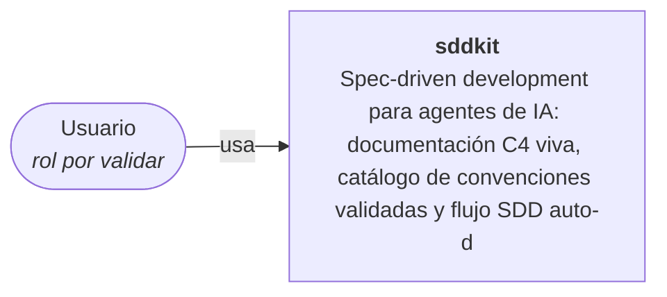

# C4 — Nivel 1: Contexto

> Generado por sddkit el 2026-06-15. Regenerado por `sdd scan` — escribí tus notas debajo de la marca manual.

**Sistema:** sddkit
**Descripción:** Spec-driven development para agentes de IA: documentación C4 viva, catálogo de convenciones validadas y flujo SDD auto-disparado. Multi-agente (Claude Code, Cursor, cualquier lector de AGENTS.md).
**Stack detectado:** JavaScript (52)

## ❓ VALIDAR con el equipo

- [ ] ¿Quiénes son los usuarios / actores externos del sistema?
- [ ] ¿Con qué sistemas externos se integra (APIs de terceros, colas, webhooks)?

> Agente: si trabajás en este repo y podés responder alguna pregunta con certeza a partir del código, respondela y marcá el checkbox. Si no, preguntale al dev.

<!-- sdd:manual — todo lo que está debajo de esta línea se preserva en regeneraciones -->

## Notas del equipo

_(esta sección no se pisa al regenerar)_
