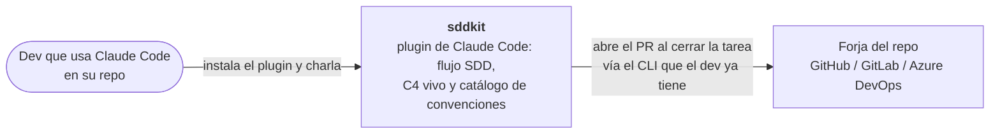

# C4 — Nivel 1: Contexto

> Actualizado a mano en la tarea 020 (2026-08-11) — escribí tus notas debajo de la marca manual.

**Sistema:** sddkit
**Descripción:** Spec-driven development para Claude: documentación C4 viva, catálogo de convenciones validadas y flujo SDD auto-disparado. Target único: Claude (ADR-0013) — el bloque gestionado vive en `CLAUDE.md`. Se distribuye solo como plugin de Claude Code (ADR-0016).
**Stack:** Markdown + JSON, sin runtime.

```mermaid
flowchart LR
  dev(["Dev que usa Claude Code<br/>en su repo"])
  sys["<b>sddkit</b><br/>plugin de Claude Code: flujo SDD,<br/>C4 vivo y catálogo de convenciones"]
  forja["Forja del repo<br/>GitHub / GitLab / Azure DevOps"]
  dev -- instala el plugin y charla --> sys
  sys -- abre el PR al cerrar la tarea<br/>vía el CLI que el dev ya tiene --> forja
```

## ❓ VALIDAR con el equipo

- [x] ¿Quiénes son los usuarios / actores externos del sistema? — el dev que trabaja con Claude Code en su repo (único actor humano) y la forja donde vive ese repo.
- [x] ¿Con qué sistemas externos se integra (APIs de terceros, colas, webhooks)? — con ninguno en runtime. Al cerrar una tarea usa el CLI de la forja instalado en la máquina del dev (BR-041); la integración con la API de Anthropic desapareció al derogarse el pre-commit LLM (BR-053).

> Agente: si trabajás en este repo y podés responder alguna pregunta con certeza a partir del código, respondela y marcá el checkbox. Si no, preguntale al dev.

<!-- sdd:manual — todo lo que está debajo de esta línea se preserva en regeneraciones -->

## Notas del equipo

_(esta sección no se pisa al regenerar)_

## Integraciones externas

| Sistema | Responsabilidad | Modo |
|---|---|---|
| CLI de la forja (`gh` / `az` / `glab`) | Abrir el PR draft al cerrar una tarea | Opcional: si no está instalado, el agente imprime las instrucciones manuales sin fallar (BR-041) |

_La integración con la API de Anthropic (pre-commit LLM) se discontinuó en la tarea 020 junto con el CLI: ya no hay hook que la invoque (BR-051 reescrita, BR-053 derogada)._
