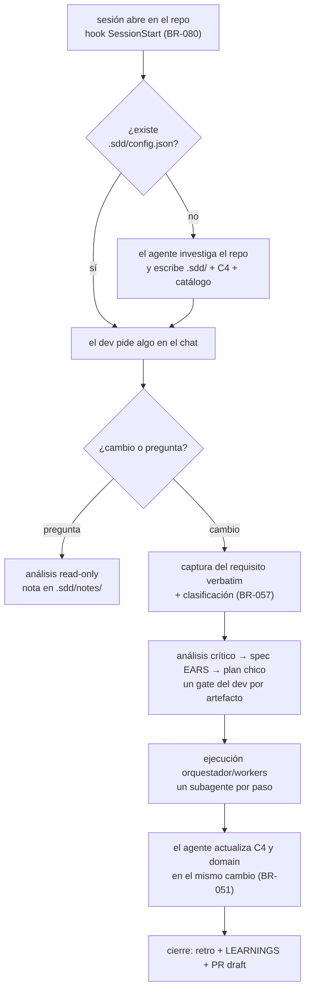

# Dominio y lógica de negocio — sddkit

> Generado por sddkit el 2026-06-15. Complemento del C4: `.sdd/c4/` dice CÓMO está construido el sistema; este archivo dice QUÉ reglas gobiernan el negocio y QUÉ significan los términos. **Las reglas de negocio son vinculantes para los agentes, igual que el catálogo de convenciones.** Las specs deben citar las reglas afectadas por su ID (BR-NNN).

## Glosario (lenguaje del dominio)

> Términos que en este negocio significan algo específico. Evita que cada agente invente su propia interpretación.

| Término | Significado en este sistema |
|---|---|
| _(completar)_ | … |

## Entidades principales

> Qué son y qué relación tienen entre sí (no su estructura técnica — eso está en el código).

_(no se detectaron candidatos automáticamente — completar desde el código y la documentación)_

## Reglas de negocio

> Numeradas y citables (BR-001, BR-002…). Cada regla: condición + comportamiento obligado + de dónde sale (doc, dev, código). Si una tarea cambia una regla, este archivo se actualiza en el mismo cambio.

- **BR-001** — _(ejemplo de formato: "Una planta sin medidor activo no puede generar facturación. Fuente: doc/negocio.md")_ ❓ completar

> **Derogaciones de la tarea 020 (BR-081).** El CLI fue eliminado (ADR-0016). Las reglas marcadas ⛔ describían comportamiento de un comando que ya no existe y **no son vinculantes**: se conserva el ID y una línea de qué garantizaban, para que las specs viejas que las citan sigan siendo legibles. Las demás se reescribieron atribuyendo el comportamiento al agente.

- **BR-023** — ⛔ Derogada (tarea 020). Instalación del hook post-commit que publicaba el grafo al commitear. Dependía del instalador del CLI.
- **BR-024** — ⛔ Derogada (tarea 020). Silencio del hook de publicación cuando el driver del grafo no era el local. Dependía del CLI.
- **BR-025** — ⛔ Derogada (tarea 020). Degradación silenciosa del hook de publicación ante gate de calidad o dependencia faltante. Dependía del CLI.
- **BR-026** — ⛔ Derogada (tarea 020). Línea de confirmación al publicar el grafo local. Dependía del CLI.
- **BR-027** — ⛔ Derogada (tarea 020). Reporte de diagnóstico del estado del hook post-commit. Dependía del CLI.
- **BR-028** — ⛔ Derogada (tarea 020). Desinstalación del hook post-commit. Dependía del CLI.
- **BR-029** — ⛔ Derogada (tarea 020). Migración de `.sdd/config.json` para agregar `hooks.autoPublish`. Dependía del CLI.
- **BR-030** — ⛔ Derogada (tarea 020). Aviso de repo no inicializado al sincronizar. Reemplazada por BR-080: el hook de arranque detecta el repo sin configurar.
- **BR-031** — ⛔ Derogada (tarea 020). Sincronización de skills/hooks/config a la versión nueva del paquete. Ya no aplica: el plugin se actualiza solo, no hay nada que copiar al repo.
- **BR-032** — ⛔ Derogada (tarea 020). Mirror real de las skills del paquete al repo destino. Las skills viven en el plugin y se leen desde `${CLAUDE_PLUGIN_ROOT}`; no se copian.
- **BR-033** — ⛔ Derogada (tarea 020). Aviso de actualización de skills globales. Ya no hay instalación por scope.
- **BR-034** — ⛔ Derogada (tarea 020). Sugerencia de sincronizar ante versión desactualizada. Dependía del diagnóstico del CLI.
- **BR-035** — ⛔ Derogada (tarea 020). Activación del driver local del grafo durante la configuración inicial. Dependía del CLI.
- **BR-036** — "El bloque gestionado de `CLAUDE.md` incluye, antes de `## Arquitectura (modelo C4 vivo)`, una sección `## Ante dudas o incongruencias: preguntale al dev` que habilita y, ante incongruencias genuinas (requisito que contradice el código, instrucción que violaría el catálogo o una BR-NNN/ADR, información faltante o ambigua, o algo que no tiene sentido), obliga al agente a frenar y preguntarle al dev antes de avanzar con una suposición — sin afectar decisiones menores resolubles con buen juicio normal". Fuente: tarea 007. _(reescrita en tarea 020: la sección la escribe el agente al configurar el repo, no un generador)._
- **BR-037** — "Cuando el agente configura un repo, genera `.sdd/c4/{context,containers,components}.md` y `.sdd/domain.md` SOLO si el archivo todavía no existe; si ya existe, lo deja sin modificar — preserva cualquier contenido agregado o editado arriba de `<!-- sdd:manual -->` (BR-NNN, checkboxes VALIDAR, glosario, entidades)". Fuente: tarea 008. _(reescrita en tarea 020)._
- **BR-038** — "Cuando el agente lee la línea `Verificación:` de `plan.md`, si el valor está envuelto en un code span (`` `cmd: ...` ``, con o sin texto adicional después del cierre), extrae el contenido del code span antes de chequear el prefijo `cmd:` — así `Verificación: cmd: <comando>` y `` Verificación: `cmd: <comando>` `` ejecutan el comando literal (su exit code decide), en vez de degradar a verificación manual". Fuente: fix post-tarea 009. _(reescrita en tarea 020)._
- **BR-039** — "Toda tarea SDD que modifica código DEBE ejecutarse en una rama dedicada (no en `main`/`develop`). La rama se crea en el Paso 1 del plan (`git checkout -b <rama>`, según `.sdd/branching.md`); si el Paso 1 falla o la rama activa resultante no coincide con la esperada, la ejecución se detiene y los pasos 2+ no corren. **El gate es el agente**: ya no hay exit code que lo fuerce". Fuente: tarea 010. _(reescrita en tarea 020)._
- **BR-040** — "La política de branching de un proyecto se define una sola vez en `.sdd/branching.md` (creado por el agente al configurar el repo); si el archivo ya existe, no se pregunta de nuevo ni se sobrescribe. El archivo versiona el histórico de cambios de política en un array `versions` (cada entrada con `date`, `author`, `convención`, `flujo`, `patrón`) más un índice `active` que apunta a la versión vigente; cambios futuros se documentan agregando una entrada nueva, sin borrar las anteriores". Fuente: tarea 010. _(reescrita en tarea 020)._
- **BR-041** — "Al cerrar una tarea, el agente verifica primero que la rama actual está pusheada a `origin`; si no lo está, avisa y no intenta nada más. Si está pusheada, detecta la plataforma del remoto `origin` (GitHub, Azure DevOps, GitLab o desconocida) e intenta crear el PR con el CLI nativo correspondiente (`gh`, `az`, `glab`). SI ese CLI no está instalado o la plataforma es desconocida, DEBE degradar a instrucciones manuales (URL de comparación + título) SIN fallar. El cierre siempre termina indicando que la revisión y el merge del PR son manuales, no automáticos". Fuente: tarea 010. _(reescrita en tarea 020)._
- **BR-042** — "Los commits dentro de una tarea SDD DEBEN seguir la convención definida en `.sdd/branching.md` (campo `convención`: Conventional Commits, Semantic Commit Messages, Gitmoji, u otra). sddkit NO la fuerza con hooks: el agente avisa (no bloquea) si detecta commits que no siguen el patrón esperado". Fuente: tarea 010. _(reescrita en tarea 020)._
- **BR-043** — ⛔ Derogada (tarea 020). Regla de parseo del check automático de drift de `components.md`. Ya no hay validación automática; el agente compara el doc contra el árbol real cuando toca la arquitectura.
- **BR-044** — ⛔ Derogada (tarea 020). Detección LLM en el pipeline de publicación. Ya estaba supersedida por BR-051-056; el grafo de impacto se discontinuó con el CLI.
- **BR-045** — ⛔ Derogada (tarea 020). Envío al LLM solo de los archivos del diff publicado. Ídem BR-044.
- **BR-046** — ⛔ Derogada (tarea 020). Schema JSON fijo de la respuesta del LLM. Ídem BR-044.
- **BR-047** — ⛔ Derogada (tarea 020). Reemplazo parcial de `capabilities` por archivo del diff. Ídem BR-044.
- **BR-048** — ⛔ Derogada (tarea 020). Marcado `pending` ante fallo del LLM sin bloquear el pipeline. Ídem BR-044.
- **BR-049** — ⛔ Derogada (tarea 020). Retiro del driver local del grafo como perfil soportado. El grafo de impacto se discontinuó con el CLI.
- **BR-050** — ⛔ Derogada (tarea 020). Reporte de repo con driver compartido sin pipeline de CI/CD. Ídem BR-049.
- **BR-051** — "Cuando un cambio toca la arquitectura, el agente actualiza en el MISMO cambio las secciones Inputs y Outputs (en `.sdd/c4/components.md`) y Casos de uso (en `.sdd/domain.md`). Antes lo disparaba un hook en cada commit; ahora es responsabilidad del agente, y por eso solo cubre los cambios que pasan por él". Fuente: tarea 010 (Pivot 2). _(reescrita en tarea 020)._
- **BR-052** — "El agente clasifica los cambios detectados en Inputs (disparadores de proceso: endpoints HTTP, listeners de queue, jobs programados), Outputs (clientes de salida: llamadas HTTP, escritura a S3/FTP, mensajes a queues, escritura a bases de datos), Entidades (entidades de negocio administradas) y Casos de uso (responsabilidades del sistema)". Fuente: tarea 010 (Pivot 2). _(reescrita en tarea 020)._
- **BR-053** — ⛔ Derogada (tarea 020). Degradación no bloqueante del commit ante fallo del LLM del pre-commit. Ya no hay hook que pueda fallar.
- **BR-054** — "Al actualizar Inputs/Outputs/Casos de uso, el agente escribe SOLO esas secciones, preservando intacto el resto de `components.md`/`domain.md`". Fuente: tarea 010 (Pivot 2). _(reescrita en tarea 020)._
- **BR-055** — ⛔ Derogada (tarea 020). Poblado de las 4 tablas del graphstore al mergear. El grafo de impacto se discontinuó con el CLI.
- **BR-056** — ⛔ Derogada (tarea 020). Metadata de autoría calculada por la CI al poblar el graphstore. Ídem BR-055.
- **BR-057** — "Al capturar el requisito de una tarea nueva, el agente la clasifica (`simple|bug|feature|refactor`, riesgo `bajo|alto`), lo anuncia en una línea y avanza con el flujo del tipo; el dev puede corregir la clasificación en cualquier momento y el agente re-clasifica si el alcance muta. **SI las señales del pedido son ambiguas o contradictorias** (el requisito admite lecturas de tamaño muy distinto, o el tipo aparente choca con el alcance real), el agente NO adivina: le pregunta al dev su expectativa —tipo, tamaño, hasta dónde profundizar— antes de clasificar. La respuesta fija la profundidad de todos los artefactos, no solo cuáles se crean". Fuente: tarea 011. _(reescrita en tarea 021 — se agregó la calibración ante ambigüedad)._
- **BR-058** — "**Un solo camino, más profundo según el riesgo.** Toda tarea escribe `requirement.md` → `analysis.md` → `plan.md`. La tarea de **riesgo alto** agrega `spec.md` (criterios de aceptación numerados) y `design.md` (detalle técnico); en el resto, los criterios van dentro del plan y no hay diseño escrito. No hay formatos especiales por tipo: en un `bug`, la reproducción va en el analysis y el test de regresión es el primer paso del plan; en un `refactor`, la corrida verde de baseline es el primer paso". Fuente: tarea 011. _(reescrita en tarea 021 — antes cada tipo tenía sus propios artefactos)._
- **BR-059** — "Todo template/skill del framework declara un presupuesto de concisión **en líneas** y los ejemplos lo respetan; `N/A: <motivo>` es respuesta válida en cualquier sección no aplicable y satisface los gates". Fuente: tarea 011. _(reescrita en tarea 021 — el presupuesto estaba en palabras, que no predice si el archivo entra en pantalla)._
- **BR-060** — "sddkit tiene un único agente target: Claude. El bloque gestionado vive en CLAUDE.md y no se genera ni mantiene soporte para otros agentes". Fuente: tarea 011 (ADR-0013).
- **BR-061** — "Los diagramas Mermaid son contenido de primera clase: `components.md` y los flujos de `domain.md` llevan diagrama, spec/plan ofrecen uno opcional (solo si reemplaza prosa), y el agente los lee como contenido, no los saltea". Fuente: tarea 011. _(reescrita en tarea 020)._
- **BR-062** — "La concisión es objetiva y la chequea el agente antes de cerrar: bullets de `LEARNINGS.md` ≤ 200 caracteres y bloques Mermaid cuya primera línea declare un tipo de diagrama válido". Fuente: tarea 011. _(reescrita en tarea 020)._
- **BR-063** — "Para mostrarle un artefacto al dev, el agente **vuelca su contenido en la terminal** y NUNCA lanza una aplicación externa. `.sdd/config.json → ui.opener` queda obsoleto: no se lee ni se escribe más. SI el artefacto supera su tope de pantalla (BR-082), el agente avisa que es largo, vuelca solo lo esencial e indica la ruta para que el dev lo abra explícitamente". Fuente: tarea 015. _(reescrita en tarea 021 — antes abría el archivo en el IDE o en el opener configurado)._
- **BR-064** — "Todo análisis produce DOS salidas con distinto destinatario: (a) al dev, en el chat, un resumen de ≤ 150 palabras — hallazgo principal + 2-4 opciones numeradas para elegir, con diagrama Mermaid en lugar de prosa cuando el flujo tiene 3+ pasos o actores (BR-061) — tras el cual el agente ESPERA la elección antes de seguir; (b) al agente, en un archivo persistido, el detalle completo con evidencia `archivo:línea`, opciones descartadas y fuentes. El detalle nunca se vuelca en el chat: se expande de a un tema, a pedido del dev". Fuente: tarea 017.
- **BR-065** — "En modo standalone (sin tarea) el análisis extendido se persiste en `.sdd/notes/<slug>.md` para poder cortar la sesión y retomarla después: si ya existe una nota del mismo tema, el agente la lee y la continúa en vez de crear otra. Esta escritura es la ÚNICA excepción a la restricción read-only de `sdd-analyze` standalone — código, artefactos de tarea y cualquier otro archivo siguen intocables". Fuente: tarea 017.
- **BR-066** — "El bloque gestionado de CLAUDE.md (sección `## Preferencias de respuesta`) instruye el contrato de BR-064 para toda respuesta del agente, no solo para las skills SDD". Fuente: tarea 017. _(reescrita en tarea 020)._

- **BR-067** — "El resumen al dev (BR-064) es AUTOCONTENIDO: todo código interno del agente — identificadores de roadmap (`Z3`), reglas numeradas (`BR-004`, `ADR-0013`), nombres de entidad propuestos — se traduce en 3-4 palabras la primera vez que aparece, o no aparece. No aplica al vocabulario técnico del dominio ni a rutas de archivo reales: la regla ataca la jerga que el agente inventó, no la que el dev ya usa". Fuente: tarea 018.
- **BR-068** — "El resumen al dev CIERRA con una pregunta explícita y respondible (\"¿cuál arranco?\", \"¿dale?\"), y cada opción declara el RESULTADO que produce elegirla (`→ podés ver plazas por barrio en la app`), no el nombre técnico de la tarea. Una lista de ítems sin pregunta de cierre no satisface BR-064". Fuente: tarea 018.
- **BR-069** — "Al configurar o re-escanear un repo, el agente detecta los MÓDULOS: en un monorepo, uno por cada workspace declarado en `package.json → workspaces`, `pnpm-workspace.yaml`, `<modules>` de `pom.xml`, `include` de `settings.gradle[.kts]` o `use` de `go.work`; si no se detecta ninguno, el repo entero es un único módulo raíz (`.`). Cada módulo lleva `path` (relativo al root), `name` y `tech`". Fuente: tarea 019. _(reescrita en tarea 020)._
- **BR-070** — "Dentro de cada módulo (BR-069), el agente detecta las CAPAS: directorios cuyo nombre corresponde a un rol conocido (`controllers`, `services`, `repositories`, `models`, `jobs`, …), a CUALQUIER profundidad del árbol del módulo — no solo el primer nivel bajo `src/`. Un directorio cuyo nombre no es un rol conocido no es una capa y no genera documentación propia". Fuente: tarea 019. _(reescrita en tarea 020)._
- **BR-071** — "Por cada capa detectada, el agente genera UN archivo `.claude/rules/sdd-layer-<capa>.md` con frontmatter `paths:` que lista los globs de TODAS las carpetas de esa capa en todos los módulos (p.ej. `packages/*/src/controllers/**`). Una capa presente en varios módulos produce una sola rule con varios globs, no una por módulo". Fuente: tarea 019. _(reescrita en tarea 020)._
- **BR-072** — "El cuerpo de una rule de capa (BR-071) es un esqueleto con tres secciones: RESPONSABILIDAD de la capa, DEPENDENCIAS PERMITIDAS (qué capas puede importar y cuáles tiene prohibidas, derivadas de un orden por defecto y marcadas `❓ VALIDAR`) y CONVENCIONES LOCALES (vacía, para el dev/agente). No duplica el catálogo global de `.sdd/catalog.json`: lo referencia". Fuente: tarea 019.
- **BR-073** — "SI el repo es un monorepo (BR-069 detectó 2+ módulos), el agente genera además un `CLAUDE.md` en la raíz de cada módulo con su responsabilidad, las capas que contiene y su relación con los otros módulos. En un repo de módulo único NO se genera ningún `CLAUDE.md` anidado — el bloque gestionado de la raíz ya cubre ese caso". Fuente: tarea 019. _(reescrita en tarea 020)._
- **BR-074** — "Los archivos generados por BR-071 y BR-073 se regeneran de forma QUIRÚRGICA: la primera vez se escriben enteros (con la marca `<!-- sdd:manual -->`); si ya existen, el agente actualiza ÚNICAMENTE lo que tiene que seguir al código — el frontmatter `paths:` en las rules de capa y la sección `## Capas que contiene` en los `CLAUDE.md` de módulo — y deja intacto todo el resto del archivo. Motivo: las respuestas y los checkboxes marcados de BR-078 viven arriba de la marca manual, así que una regeneración total los borraría". Fuente: tarea 019. _(reescrita en tarea 020)._
- **BR-075** — ⛔ Derogada (tarea 020). Remoción de las rules de capa y los `CLAUDE.md` de módulo al desinstalar. Ya no hay desinstalador: desinstalar el plugin no toca el repo, y los archivos generados los borra el dev si quiere.
- **BR-076** — "Una rule de capa cuyo glob no matchea ningún archivo del repo nunca se carga y falla en silencio: cuando el agente toca `.claude/rules/sdd-layer-*.md`, chequea que cada glob matchee algo y avisa (no bloquea) si encuentra una rule muerta". Fuente: tarea 019. _(reescrita en tarea 020)._
- **BR-077** — "El bloque gestionado de `CLAUDE.md` declara que las convenciones por capa viven en `.claude/rules/sdd-layer-*.md` y cargan solas al tocar archivos de esa capa, y que las responsabilidades por módulo viven en el `CLAUDE.md` de cada módulo — para que el agente no las busque ni las duplique en el bloque global". Fuente: tarea 019.
- **BR-078** — "Los huecos por completar de las rules de capa (BR-072) y de los `CLAUDE.md` de módulo (BR-073) se escriben como checkboxes `- [ ]` en una sección `## ❓ VALIDAR con el equipo`, igual que los docs C4 — no como prosa suelta. El agente los agrega a `.sdd/QUESTIONS.md` indicando su archivo de origen. Así entran al circuito existente: el agente los responde desde el código o le pregunta al dev, y marca el checkbox en el archivo de origen". Fuente: tarea 019.
- **BR-079** — "sddkit se distribuye EXCLUSIVAMENTE como plugin de Claude Code (`.claude-plugin/plugin.json` + `marketplace.json`): no se publica como paquete npm, no provee binario `sdd` ni ningún comando que el dev deba ejecutar, y su contenido es markdown y templates — instalarlo no requiere Node ni ninguna otra runtime". Fuente: tarea 020.
- **BR-080** — "El plugin registra un hook `SessionStart` que, si el repo NO tiene `.sdd/config.json`, vuelca al contexto del agente el contenido de `hooks/bootstrap.md` (instrucciones de qué investigar en el repo para configurarlo). Si el archivo de config existe, el hook no emite nada: cero ruido en repos ya configurados". Fuente: tarea 020.
- **BR-081** — "Toda regla que atribuía un comportamiento a un comando del CLI eliminado se reescribe atribuyendo ese comportamiento AL AGENTE siguiendo la skill correspondiente, o se deroga (marcada ⛔, sin borrar el ID) si dependía de una garantía que solo un exit code podía dar. Ninguna BR vigente puede citar un comando inexistente — tampoco esta regla, por eso no los enumera". Fuente: tarea 020.
- **BR-082** — "**El tope de pantalla es de 45 líneas.** Todo artefacto del flujo declara su tope en líneas y el agente lo cuenta antes de mostrarlo. El número sale de medir lo que entra en una terminal sin scroll, no de una preferencia". Fuente: tarea 021.
- **BR-083** — "CUANDO un artefacto supera su tope (BR-082), eso es señal de que la tarea es demasiado grande: el agente lo dice y propone partirla, además de volcar solo lo esencial e indicar la ruta (BR-063). Un artefacto largo NO se acepta en silencio". Fuente: tarea 021.
- **BR-084** — "`analysis.md` tiene exactamente tres secciones y ninguna más: (a) el entendimiento del pedido en muy pocas palabras, (b) un diagrama Mermaid que explica lo mismo, solo si aplica, y (c) los huecos: **máximo 5**, preguntados de a uno y cada uno con su respuesta sugerida. Su propósito es entender el pedido y cubrir los huecos — no hay sección fija de análisis crítico, recomendación ni métrica. Pasado el quinto hueco, el agente asume con criterio y declara el supuesto en la spec en vez de seguir preguntando". Fuente: tarea 021.
- **BR-085** — "`plan.md` es una **lista de pasos de una línea**, cada uno con su verificación (`cmd:`) — no un documento. El detalle técnico (impacto en arquitectura y catálogo, archivos a tocar, dependencias entre pasos) vive en `design.md`, que solo escribe la tarea de riesgo alto". Fuente: tarea 021.
- **BR-086** — "CUANDO se cierra una tarea, los aprendizajes que superen el umbral 'otro agente tropezaría con esto' se escriben **directo** en `.sdd/LEARNINGS.md`, sin documento intermedio. No existe artefacto de retro ni métrica de impacto: se eliminaron en la tarea 021 y su reintroducción requiere una decisión explícita del dev". Fuente: tarea 021.
- **BR-087** — "CUANDO el agente vuelca un artefacto que contiene un bloque Mermaid y `termaid` está disponible en el `PATH`, renderiza el diagrama en la terminal. SI no está disponible y el dev no lo rechazó antes, se lo ofrece **una sola vez** (`pip install termaid`, o `uvx termaid` sin instalar); la respuesta —incluido el 'no'— se persiste en `.sdd/config.json → ui.termaid` y no se vuelve a preguntar. SI no está disponible, el bloque se muestra crudo y el flujo sigue sin error (ADR-0017)". Fuente: tarea 021.

## Flujos clave del negocio

> Los recorridos que explican el sistema (qué pasa cuándo, en términos de negocio — no de código).

- Onboarding: al abrir sesión en un repo sin configurar, el agente lo investiga y deja C4 vivo, catálogo y convenciones por capa — el dev solo responde preguntas (BR-079/BR-080).
- Convenciones: el agente detecta variantes al escanear; el dev elige la ganadora y queda en `.sdd/catalog.json`.
- Tarea SDD: captura → análisis → spec → plan → ejecución en subagentes → cierre con retro.
- Documentación viva: ya no hay hook que la actualice sola — el agente mantiene Inputs/Outputs/Casos de uso al día en el mismo cambio que toca la arquitectura (BR-051), y por eso solo cubre lo que pasa por él.
- Impacto cross-repo: discontinuado junto con el CLI (BR-044 a BR-050, BR-055/056 derogadas).

## ❓ VALIDAR con el equipo

- [ ] ¿El glosario cubre los términos que un dev nuevo malinterpretaría?
- [ ] ¿Las reglas de negocio listadas son todas las vigentes? ¿Falta alguna que hoy solo vive en la cabeza de alguien?

<!-- sdd:manual — todo lo que está debajo de esta línea se preserva en regeneraciones -->

## Notas del equipo

_(esta sección no se pisa al regenerar)_
