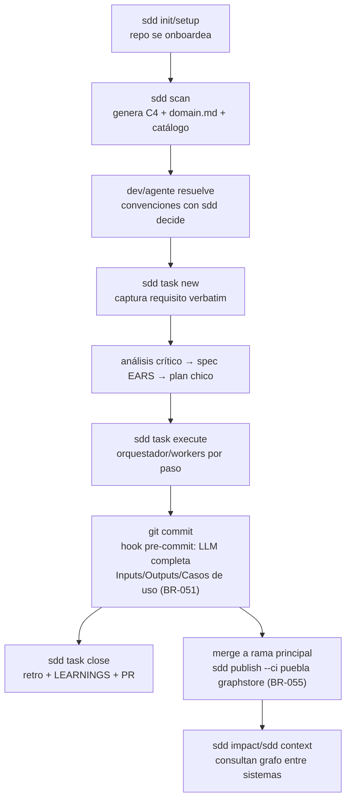

# Dominio y lógica de negocio — sddkit

> Generado por sddkit el 2026-06-15. Complemento del C4: `.sdd/c4/` dice CÓMO está construido el sistema; este archivo dice QUÉ reglas gobiernan el negocio y QUÉ significan los términos. **Las reglas de negocio son vinculantes para los agentes, igual que el catálogo de convenciones.** Las specs deben citar las reglas afectadas por su ID (BR-NNN).

## Glosario (lenguaje del dominio)

> Términos que en este negocio significan algo específico. Evita que cada agente invente su propia interpretación.

| Término | Significado en este sistema |
|---|---|
| _(completar)_ | … |

## Entidades principales

> Qué son y qué relación tienen entre sí (no su estructura técnica — eso está en el código).

_(no se detectaron candidatos automáticamente — completar desde el código y la documentación)_

## Reglas de negocio

> Numeradas y citables (BR-001, BR-002…). Cada regla: condición + comportamiento obligado + de dónde sale (doc, dev, código). Si una tarea cambia una regla, este archivo se actualiza en el mismo cambio.

- **BR-001** — _(ejemplo de formato: "Una planta sin medidor activo no puede generar facturación. Fuente: doc/negocio.md")_ ❓ completar
- **BR-023** — "Cuando se corre `sdd setup`/`sdd init` en un repo con `.git`, el sistema instala (además del pre-commit existente) un hook post-commit que ejecuta `sdd publish --hook || true`, sin pisar hooks post-commit existentes (agrega al final, mismo patrón no destructivo que `installPreCommit`, vía nueva `installPostCommit` en `src/lib/hooks.js`)". Fuente: tarea 004.
- **BR-024** — "Cuando se ejecuta `sdd publish --hook` y `.sdd/config.json → graph.driver` no es `\"sqlite\"` (no configurado, o `\"mysql\"`), o `.sdd/config.json → hooks.autoPublish === false`, el sistema termina sin publicar y sin imprimir nada (exit 0) — preserva ADR-0003 sin cambios para `mysql` (ver ADR-0010)". Fuente: tarea 004.
- **BR-025** — "Si `sdd publish --hook` corre con `graph.driver === \"sqlite\"` y `hooks.autoPublish !== false`, pero el gate de calidad (BR-013, checkboxes `- [ ]` pendientes en `.sdd/c4/`) rechaza la publicación o falta la dependencia opcional `better-sqlite3` (ADR-0008), el sistema degrada en silencio (sin imprimir nada, exit 0) — el dev puede diagnosticar con `sdd publish`/`sdd doctor`, que sí muestran el detalle". Fuente: tarea 004.
- **BR-026** — "Cuando `sdd publish --hook` publica exitosamente (mismas condiciones de éxito que `sdd publish` manual, BR-013), el sistema imprime una línea corta de confirmación con nombre canónico, hash corto y timestamp (p.ej. `✓ grafo local actualizado (sqlite) → commit <hash corto> @ <timestamp>`)". Fuente: tarea 004.
- **BR-027** — "Cuando se corre `sdd doctor`, el sistema reporta el estado del hook post-commit (instalado / ausente — sugiere `sdd setup` / desactivado por `hooks.autoPublish === false`), análogo al reporte existente del pre-commit". Fuente: tarea 004.
- **BR-028** — "Cuando se corre `sdd uninstall`, el sistema remueve la línea del hook post-commit agregada por sddkit (o el archivo `.git/hooks/post-commit` completo si era solo de sddkit), análogo al manejo existente de pre-commit". Fuente: tarea 004.
- **BR-029** — "Cuando `sdd init`/`sdd setup` crea o migra `.sdd/config.json`, el sistema incluye `hooks.autoPublish: true` junto a `hooks.preCommit: true` (configs existentes sin el campo se migran agregándolo)". Fuente: tarea 004.
- **BR-030** — "Cuando se corre `sdd sync` en un repo SIN `.sdd/config.json`, el sistema informa que el repo no está inicializado, sugiere `sdd setup`, y no crea ni modifica ningún archivo". Fuente: tarea 005.
- **BR-031** — "Cuando se corre `sdd sync` en un repo CON `.sdd/config.json`, el sistema ejecuta el equivalente de `sdd init` (migración de config, regeneración del bloque gestionado de AGENTS.md, reinstalación/actualización de skills `sdd-*` en el scope de `cfg.skills`, reinstalación/migración de hooks pre-commit y post-commit, rule de Cursor si aplica) SIN correr `scan` ni el wizard de convenciones, e imprime un resumen con la transición de versión: `vANTERIOR → vNUEVA` (o "ya estás al día en vX.Y.Z" si `cfg.version === VERSION` antes de sincronizar); si `cfg.version === VERSION` pero `init` migró `.sdd/config.json` igual (p.ej. BR-029), el resumen indica que el config fue migrado en lugar de "ya estás al día"". Fuente: tarea 005. _Nota (tarea 016): el resumen ahora refleja cambios reales — imprime `· <acción>` solo por lo que efectivamente cambió (bloque gestionado de CLAUDE.md comparado ignorando la fecha de "Última actualización", skills mirroreadas solo si difieren del paquete, hooks), `– <ítem> al día` por lo que no cambió, y "sin cambios — todo ya estaba al día" cuando no hubo ninguna acción. La frase "ya estás al día en vX.Y.Z" quedó reemplazada por este resumen detallado._
- **BR-032** — "Cuando `installSkills` actualiza una carpeta `sdd-*` que ya existe en el destino, el sistema la deja idéntica a la carpeta correspondiente del paquete instalado — incluyendo eliminar del destino cualquier archivo/subcarpeta que ya no exista en el paquete (mirror real, no merge). Aplica a `sync`, `init` y `setup` por igual (misma función compartida)". Fuente: tarea 005.
- **BR-033** — "Cuando `cfg.skills === 'global'`, el sistema imprime un aviso explícito indicando que se actualizaron las skills GLOBALES (`~/.claude/skills/sdd-*`), compartidas por todos los repos de la máquina". Fuente: tarea 005.
- **BR-034** — "Cuando `sdd doctor` detecta `config.version !== VERSION`, hooks pre-commit/post-commit ausentes, o skills `sdd-*` faltantes/desactualizadas en el scope configurado, el sistema sugiere `sdd sync` (no `sdd setup`) como remedio. La advertencia de `sdd-bootstrap` global (instalada solo por `setup`) sigue sugiriendo `sdd setup`". Fuente: tarea 005.
- **BR-035** — "Cuando `sdd setup` corre en un repo cuyo `.sdd/config.json` no tiene `graph` configurado, el sistema activa `graph.driver: \"sqlite\"` y persiste la ruta del archivo en `graph.sqlite.path`: en modo interactivo (TTY, sin `--agent`) pregunta la ruta mostrando `~/.sddkit/graph.db` como default (Enter o respuesta vacía la acepta); en modo `--agent`/sin TTY usa ese default sin preguntar. Si `graph` ya está configurado (driver `sqlite` o `mysql`, de una corrida anterior o edición manual), no pregunta ni modifica nada. `sdd init`/`sdd sync` standalone no agregan ni migran `graph`". Fuente: tarea 006.
- **BR-036** — "Cuando se genera o regenera el bloque gestionado de AGENTS.md (vía `sdd init`, `sdd scan`, `sdd setup` o `sdd decide`, a través de `buildBlock`/`upsertAgentsMd` en `src/lib/agentsmd.js`), el sistema incluye, como primera sección del bloque (antes de `## Arquitectura (modelo C4 vivo)`), una sección `## Ante dudas o incongruencias: preguntale al dev` que habilita y, ante incongruencias genuinas (requisito que contradice el código, instrucción que violaría el catálogo o una BR-NNN/ADR, información faltante o ambigua, o algo que no tiene sentido), obliga al agente a frenar y preguntarle al dev antes de avanzar con una suposición — sin afectar decisiones menores resolubles con buen juicio normal". Fuente: tarea 007.
- **BR-037** — "Cuando `sdd scan` corre, genera `.sdd/c4/{context,containers,components}.md` y `.sdd/domain.md` SOLO si el archivo todavía no existe; si ya existe, lo deja sin modificar — preserva cualquier contenido agregado o editado arriba de `<!-- sdd:manual -->` (BR-NNN, checkboxes VALIDAR, glosario, entidades) entre corridas". Fuente: tarea 008.
- **BR-038** — "Cuando `sdd task verify <id> <paso>` parsea la línea `Verificación:` de `plan.md`, si el valor está envuelto en un code span (`` `cmd: ...` ``, con o sin texto adicional después del cierre), el sistema extrae el contenido del code span antes de chequear el prefijo `cmd:` — así `Verificación: cmd: <comando>` y `` Verificación: `cmd: <comando>` `` (con o sin prosa final) ejecutan el comando literal (exit code = resultado), en vez de degradar siempre a verificación manual (exit 3)". Fuente: fix directo post-tarea 009 (retro).
- **BR-039** — "Toda tarea SDD que modifica código DEBE ejecutarse en una rama dedicada (no en `main`/`develop`). La rama se crea automáticamente en `sdd task execute` Paso 1 (`git checkout -b <rama>`, auto-generado por `sdd task plan` según `.sdd/branching.md`); si el Paso 1 falla o la rama activa resultante no coincide con la esperada, la ejecución se detiene y los pasos 2+ no corren (gate bloqueante, `runExecuteGate` en `src/commands/execute.js`)". Fuente: tarea 010.
- **BR-040** — "La política de branching de un proyecto se define una sola vez en `.sdd/branching.md` (creado por `sdd init`/`sdd setup`, vía `ensureBranchingPolicy` en `src/lib/branching.js`); si el archivo ya existe, no se pregunta de nuevo ni se sobrescribe. El archivo versiona el histórico de cambios de política en un array `versions` (cada entrada con `date`, `author`, `convención`, `flujo`, `patrón`) más un índice `active` que apunta a la versión vigente; cambios futuros a la política se documentan agregando una nueva entrada a `versions` con timestamp y autor, sin borrar las anteriores". Fuente: tarea 010.
- **BR-041** — "Cuando `sdd task close <id>` crea un PR, el sistema verifica primero que la rama actual está pusheada a `origin` (`verifyBranchPushed`); si no lo está, avisa y no intenta nada más. Si está pusheada, detecta la plataforma del remoto `origin` (`detectGitPlatform`: GitHub, Azure DevOps, GitLab o `unknown`) e intenta usar el tool nativo correspondiente (`gh`, `az`, `gl`) vía `buildPRCommand`/`isPRToolAvailable`. SI el tool no está instalado, no está disponible, o la plataforma es `unknown`, el sistema DEBE degradar a `buildManualPRInstructions` (\"PR ready to create manually\" + URL/instrucción) SIN fallar — el reporte final siempre documenta `# PR: …` y termina con `# Próximo: revisión manual y merge del PR (no automático)`". Fuente: tarea 010. _Nota (tarea 011): `buildPRCommand` ahora devuelve `{cmd, args}` (no un string) y la ejecución del comando de PR usa `spawnSync` SIN shell, pasando title/body/rama/base como argumentos literales (defensa contra inyección de shell). El contrato de degradación a `buildManualPRInstructions` y el reporte `# PR: …` quedan intactos._
- **BR-042** — "Los commits dentro de una tarea SDD DEBEN seguir la convención de commits definida en `.sdd/branching.md` (campo `convención`: Conventional Commits, Semantic Commit Messages, Gitmoji, u otra). sddkit NO fuerza esta convención con hooks (fuera de alcance Fase 1): `sdd task verify`/`sdd task close` pueden avisar (warning, no bloqueante) si detectan commits que no siguen el patrón esperado, documentándolo en el reporte de cierre". Fuente: tarea 010.
- **BR-043** — "Cuando `sdd validate` realiza el check de drift de `components.md`, el sistema extrae los módulos documentados (`docDirs`) únicamente de la primera sección del archivo — antes del primer encabezado de nivel 2 o 3 (`##`/`###`) — ignorando tablas que figuren en secciones secundarias (incluyendo `## ❓ VALIDAR con el equipo`, la sección manual `<!-- sdd:manual -->` y todo lo que sigue). Esto evita falsos positivos cuando un agente enriquece `components.md` con tablas de subcapas (ej: packages Java en arquitectura hexagonal)". Fuente: tarea 008.
- **BR-044** — "Cuando se corre `sdd publish` como parte de un pipeline de CI/CD (push/merge a la rama principal definida en `.sdd/branching.md`), el sistema ejecuta la detección LLM independientemente de si el código llegó a través de una tarea `/sdd-task` o de un commit hecho fuera del flujo SDD". Fuente: tarea 010. ⚠️ Supersedida por BR-051-056 (Pivot 2, mecanismo pre-commit) — se conserva el texto original sin editar, ver spec.md.
- **BR-045** — "Cuando corre la detección LLM en `sdd publish`, el sistema calcula los archivos modificados entre el último `commitHash` publicado y `HEAD`, y envía al LLM únicamente esos archivos — nunca un re-escaneo del repo completo". Fuente: tarea 010. ⚠️ Supersedida por BR-051-056 (Pivot 2, mecanismo pre-commit) — se conserva el texto original sin editar, ver spec.md.
- **BR-046** — "El sistema requiere al LLM una respuesta en JSON con schema fijo (`endpoints: [{method, path, file, confidence}]`, `consumptions: [{method, target, file, confidence}]}`) con temperatura baja, y rechaza/reintenta una respuesta que no valide contra ese schema". Fuente: tarea 010. ⚠️ Supersedida por BR-051-056 (Pivot 2, mecanismo pre-commit) — se conserva el texto original sin editar, ver spec.md.
- **BR-047** — "Cuando el LLM devuelve un resultado válido para los archivos del diff en `sdd publish`, el sistema reemplaza únicamente las entradas de `capabilities.endpoints`/`consumptions` de esos archivos, preservando sin cambios las entradas de archivos no incluidos en el diff". Fuente: tarea 010. ⚠️ Supersedida por BR-051-056 (Pivot 2, mecanismo pre-commit) — se conserva el texto original sin editar, ver spec.md.
- **BR-048** — "Si la invocación al LLM falla, agota reintentos o excede timeout durante `sdd publish`, el sistema marca las entradas de los archivos afectados con estado `pending` (\"pendiente de analizar\"), publica igual el resto del snapshot, y termina sin bloquear el pipeline (exit 0) — preserva degradación silenciosa análoga a BR-025". Fuente: tarea 010. ⚠️ Supersedida por BR-051-056 (Pivot 2, mecanismo pre-commit) — se conserva el texto original sin editar, ver spec.md.
- **BR-049** — "El sistema debe dejar de ofrecer `graph.driver: \"sqlite\"` como perfil soportado: `sdd setup` ya no lo propone como opción, y `sdd doctor` reporta como error de configuración cualquier repo que lo tenga configurado, indicando que el proyecto requiere CI/CD y un driver compartido (`mysql`) para el grafo de impacto". Fuente: tarea 010.
- **BR-050** — "Si un repo con driver compartido (`mysql`) configurado no tiene un pipeline de CI/CD corriendo `sdd publish`, el sistema lo reporta explícitamente en `sdd context`/`sdd doctor` (mensaje análogo al \"Sin publicar — correr `sdd publish`\" existente, pero indicando que hace falta CI/CD)". Fuente: tarea 010.
- **BR-051** — "Cuando se corre `git commit` en un repo SDD, el hook pre-commit invoca un LLM para completar/actualizar las secciones Inputs, Outputs (en `.sdd/c4/components.md`) y Casos de uso (en `.sdd/domain.md`), en TODOS los commits, sin filtrar por relevancia de los archivos modificados". Fuente: tarea 010 (Pivot 2).
- **BR-052** — "El LLM clasifica los cambios detectados en Inputs (disparadores de proceso: endpoints HTTP, listeners de queue, jobs programados), Outputs (clientes de salida: llamadas HTTP, escritura a S3/FTP, mensajes a queues, escritura a bases de datos), Entidades (entidades de negocio administradas, ya existente) y Casos de uso (responsabilidades/casos de uso del sistema)". Fuente: tarea 010 (Pivot 2).
- **BR-053** — "Si la invocación al LLM durante el hook pre-commit falla (sin red, sin API key, timeout, rate-limit), el sistema deja el commit continuar sin bloquear, preservando las secciones en su última versión válida, y loguea una advertencia". Fuente: tarea 010 (Pivot 2).
- **BR-054** — "Al actualizar Inputs/Outputs/Casos de uso durante el pre-commit, el sistema escribe SOLO esas secciones, preservando intacto el resto de `components.md`/`domain.md`". Fuente: tarea 010 (Pivot 2).
- **BR-055** — "Cuando `sdd publish --ci` corre al mergear a la rama principal, el sistema parsea (sin LLM, determinístico) las secciones Inputs/Outputs/Entidades/Casos de uso del commit mergeado y puebla 4 tablas separadas en el graphstore mysql (una por categoría), relacionadas entre sí por `canonicalName` del sistema". Fuente: tarea 010 (Pivot 2).
- **BR-056** — "Cuando la CI puebla esas 4 tablas en BR-055, el sistema agrega metadata de autoría (quién, cuándo, en qué commit) calculada vía `git blame`/metadata del commit — nunca escrita por el LLM dentro del contenido de las secciones". Fuente: tarea 010 (Pivot 2).
- **BR-057** — "Tras `sdd task new`, el agente clasifica la tarea (`simple|bug|feature|refactor`, riesgo `bajo|alto`), lo anuncia en una línea y avanza con el flujo del tipo; el dev puede corregir la clasificación en cualquier momento y el agente re-clasifica si el alcance muta". Fuente: tarea 011.
- **BR-058** — "Flujo por tipo: `simple` = un gate breve → implementar con tests; `bug` = reproducir → test rojo → fix (el test de regresión reemplaza la spec); `feature` = flujo completo, profundidad según riesgo; `refactor` = análisis de impacto + tests verdes antes/después, sin criterios EARS. Solo se crean los artefactos que el tipo requiere". Fuente: tarea 011.
- **BR-059** — "Todo template/skill del framework declara un presupuesto de concisión y los ejemplos lo respetan; `N/A: <motivo>` es respuesta válida en cualquier sección no aplicable y satisface los gates". Fuente: tarea 011.
- **BR-060** — "sddkit tiene un único agente target: Claude. El bloque gestionado vive en CLAUDE.md y no se genera ni mantiene soporte para otros agentes". Fuente: tarea 011 (ADR-0013).
- **BR-061** — "Los diagramas Mermaid son contenido de primera clase: `components.md` y los flujos de `domain.md` llevan diagrama, spec/plan ofrecen uno opcional (solo si reemplaza prosa), y `sdd context` los incluye en el destilado". Fuente: tarea 011.
- **BR-062** — "`sdd validate` chequea concisión objetiva: bullets de `LEARNINGS.md` ≤ 200 caracteres y bloques Mermaid cuya primera línea declare un tipo de diagrama válido". Fuente: tarea 011.
- **BR-063** — "La apertura de archivos hacia el dev es sensible al contexto de terminal: en terminal embebida de un IDE (`TERMINAL_EMULATOR=JetBrains-JediTerm` o `TERM_PROGRAM=vscode`) los archivos se muestran en ese mismo IDE; en terminal standalone se usa el comando de `.sdd/config.json → ui.opener` si está configurado, y sin él el default del SO. Aplica a ambos caminos: (a) el bloque gestionado de CLAUDE.md (`buildBlock`, `src/lib/agentsmd.js`) instruye al agente con esta regla en `## Preferencias de respuesta`; (b) `openFile` (`src/lib/open.js`) la implementa para los artefactos que el CLI abre automáticamente — en terminal embebida abre en el IDE anfitrión vía `open -b $__CFBundleIdentifier` (macOS) y degrada al default del SO si no hay señal de bundle". Fuente: tarea 015.
- **BR-064** — "Todo análisis produce DOS salidas con distinto destinatario: (a) al dev, en el chat, un resumen de ≤ 150 palabras — hallazgo principal + 2-4 opciones numeradas para elegir, con diagrama Mermaid en lugar de prosa cuando el flujo tiene 3+ pasos o actores (BR-061) — tras el cual el agente ESPERA la elección antes de seguir; (b) al agente, en un archivo persistido, el detalle completo con evidencia `archivo:línea`, opciones descartadas y fuentes. El detalle nunca se vuelca en el chat: se expande de a un tema, a pedido del dev". Fuente: tarea 017.
- **BR-065** — "En modo standalone (sin tarea) el análisis extendido se persiste en `.sdd/notes/<slug>.md` para poder cortar la sesión y retomarla después: si ya existe una nota del mismo tema, el agente la lee y la continúa en vez de crear otra. Esta escritura es la ÚNICA excepción a la restricción read-only de `sdd-analyze` standalone — código, artefactos de tarea y cualquier otro archivo siguen intocables". Fuente: tarea 017.
- **BR-066** — "El bloque gestionado de CLAUDE.md (`buildBlock`, `src/lib/agentsmd.js`, sección `## Preferencias de respuesta`) instruye el contrato de BR-064 para toda respuesta del agente, no solo para las skills SDD". Fuente: tarea 017.

- **BR-067** — "El resumen al dev (BR-064) es AUTOCONTENIDO: todo código interno del agente — identificadores de roadmap (`Z3`), reglas numeradas (`BR-004`, `ADR-0013`), nombres de entidad propuestos — se traduce en 3-4 palabras la primera vez que aparece, o no aparece. No aplica al vocabulario técnico del dominio ni a rutas de archivo reales: la regla ataca la jerga que el agente inventó, no la que el dev ya usa". Fuente: tarea 018.
- **BR-068** — "El resumen al dev CIERRA con una pregunta explícita y respondible (\"¿cuál arranco?\", \"¿dale?\"), y cada opción declara el RESULTADO que produce elegirla (`→ podés ver plazas por barrio en la app`), no el nombre técnico de la tarea. Una lista de ítems sin pregunta de cierre no satisface BR-064". Fuente: tarea 018.

## Flujos clave del negocio

> Los recorridos que explican el sistema (qué pasa cuándo, en términos de negocio — no de código).

- Onboarding: `sdd init`/`setup` deja el repo con C4 vivo, catálogo y hooks instalados.
- Convenciones: `sdd scan` detecta variantes; el dev las resuelve con `sdd decide`.
- Tarea SDD: captura → análisis → spec → plan → ejecución en subagentes → cierre con retro.
- Documentación viva: cada commit dispara al LLM del pre-commit para mantener Inputs/Outputs/Casos de uso al día (BR-051).
- Impacto cross-repo: al mergear, `sdd publish --ci` puebla el graphstore compartido que `sdd impact`/`sdd context` consultan.

## ❓ VALIDAR con el equipo

- [ ] ¿El glosario cubre los términos que un dev nuevo malinterpretaría?
- [ ] ¿Las reglas de negocio listadas son todas las vigentes? ¿Falta alguna que hoy solo vive en la cabeza de alguien?

<!-- sdd:manual — todo lo que está debajo de esta línea se preserva en regeneraciones -->

## Notas del equipo

_(esta sección no se pisa al regenerar)_
