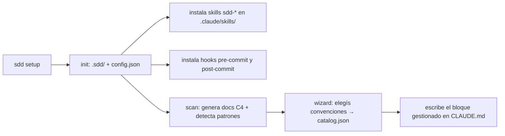
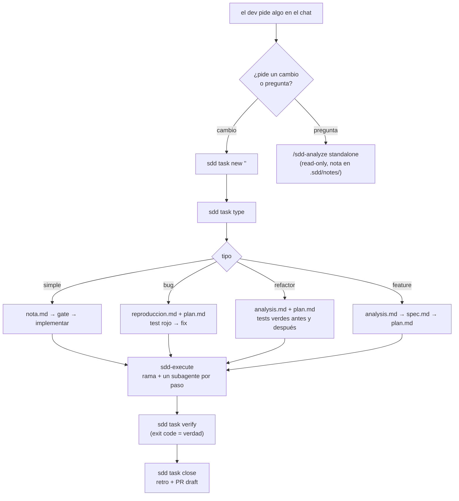
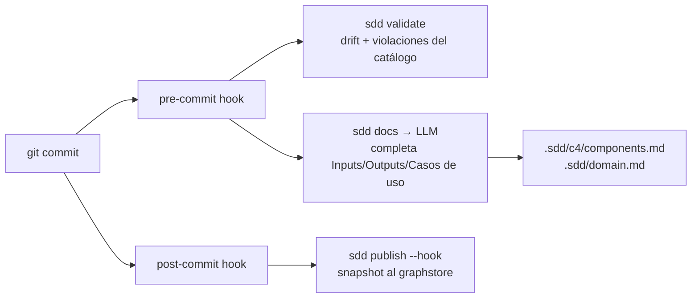

# Flujo de sddkit — cómo funciona hoy

**Estado:** en curso · **Última sesión:** 2026-08-02

## Conclusión hasta ahora

sddkit tiene **tres flujos que se tocan poco entre sí**:

1. **Instalación** (`setup` / `sync`) — una vez por repo, después casi nunca.
2. **Tarea SDD** (`task new` → `close`) — el ciclo diario, disparado por lo que escribís en el chat.
3. **Documentación viva** (`pre-commit` / `publish`) — corre solo, en cada commit.

Lo que conecta los tres es `.sdd/`: la carpeta es el estado compartido. El CLI casi no tiene lógica de negocio propia — su trabajo es **preparar contexto para el agente y verificar lo que el agente dice que hizo**.

---

## 1. Instalación (una vez por repo)

- `sdd setup` = todo junto, interactivo. Es el único comando pensado para que lo corras vos.
- `sdd sync` = el mismo trabajo **sin** scan ni wizard. Se usa después de actualizar el paquete npm.
- `sdd init` = solo los archivos.
- `sdd doctor` = diagnóstico read-only de todo lo anterior.

**Detalle que importa:** las skills se copian de `skills/` (fuente del paquete) a `.claude/skills/` (destino). Es un mirror real, BR-032: editar el destino no sirve, `sync` lo pisa.

---

## 2. Tarea SDD (el ciclo diario)

El disparo no es un comando: es el bloque gestionado de `CLAUDE.md` diciéndole al agente "si el dev pide un cambio, corré `/sdd-task`".

**Los gates.** Entre cada artefacto hay una aprobación tuya en el chat. El CLI abre el archivo (`sdd task status <id> <estado>`) y el agente frena hasta que decís que sí. No hay forma de saltearlos desde el CLI.

**Qué hace el CLI y qué hace el agente:**

| | CLI (`sdd`) | Agente (skills) |
|---|---|---|
| Artefactos | crea el esqueleto vacío | escribe el contenido |
| Contexto | `context`, `find`, `brief` — recortes determinísticos | los consume |
| Verificación | `verify` corre el `cmd:` del paso | no se le cree el reporte, se corre el comando |
| Rama y PR | `execute` (gate), `close` (PR) | pide la aprobación |

**El truco de `brief`:** `sdd task brief <id> <paso>` arma el contexto mínimo de un paso (el paso + la spec + las reglas citadas + el catálogo). Eso es lo que recibe el subagente, en vez de "leete la spec entera". Se paga una vez por paso.

---

## 3. Documentación viva (automático)

- Si falta `ANTHROPIC_API_KEY`, `sdd docs` avisa y **deja pasar el commit** (BR-053). Es lo que estuviste viendo en cada commit de esta sesión.
- `sdd publish` alimenta el grafo que después usa `sdd impact <archivo>` para decir quién depende de qué.

---

## Estado compartido: `.sdd/`

| Archivo | Qué guarda | Quién lo escribe |
|---|---|---|
| `config.json` | versión, driver del grafo, opener, hooks | `setup`/`sync` |
| `domain.md` | glosario + reglas BR-NNN **vinculantes** | el agente, en tareas |
| `c4/*.md` | contexto, contenedores, componentes | `scan` + el hook pre-commit |
| `decisions/` | ADRs (no se contradicen sin uno nuevo) | el agente |
| `catalog.json` | convenciones ya decididas | `decide`, wizard |
| `LEARNINGS.md` | aprendizajes destilados de las retros | `sdd-close` |
| `tasks/<id>/` | requirement, analysis, spec, plan, retro | el agente |
| `branching.md` | política de ramas y commits | `setup` |
| `notes/` | investigaciones standalone (esta nota) | `sdd-analyze` |

---

## Abierto

- [ ] `sdd task close` crea el PR en draft y marca `done` **después**, así que el estado nunca entra al PR. Pasó en las tareas 017 y 018.
- [ ] El bloque gestionado de `CLAUDE.md` está en 448 de 450 palabras: no entra nada más sin sacar algo.
- [ ] `sdd publish` necesita CI/CD y driver mysql (BR-049/050); este repo no lo tiene configurado, así que el grafo de impacto está vacío.
