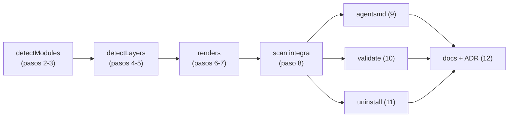

# Plan — tarea 019: convenciones por capa/módulo con progressive disclosure

> Pasos CHICOS, tests ANTES de la implementación que cubren. Máximo 3 sub-ítems por paso. El dev debe APROBAR este plan antes de ejecutar.

## Diagrama de dependencias

## Rama de trabajo

- **Rama:** `task/019-vamos-a-actualizar-esto-ya-que`
- **Origen:** `main`
- **Destino:** `main`
- **Convención de commits:** Conventional Commits
- **Flujo:** GitHub Flow
- **Patrón:** `task/{numero}-{slug}`

## Pasos

- [x] **1. Crear rama de trabajo** _(rapido)_
  - **Hace:** crear y cambiar a la rama de trabajo de la tarea
  - **Archivos:** —
  - **Depende de:** —
  - **Verificación:** `cmd: git checkout -b task/019-vamos-a-actualizar-esto-ya-que`

- [x] **2. Fixtures + tests de `detectModules`** _(medio)_
  - **Hace:** fixtures de monorepo (npm workspaces, `pnpm-workspace.yaml`, `pom.xml` con `<modules>`, `settings.gradle`, `go.work`) y de repo simple; tests que esperan `[{path,name,tech}]` y el fallback a módulo raíz `.` (BR-069). `src/lib/__fixtures__/`, `src/lib/layers.test.js`
  - **Verificación:** `cmd: node --test src/lib/layers.test.js; test $? -ne 0`

- [x] **3. Implementar `detectModules`** _(medio)_
  - **Hace:** parseo de los 5 orígenes de workspace + fallback a módulo único (BR-069). `src/lib/layers.js`
  - **Depende de:** paso 2
  - **Verificación:** `cmd: node --test src/lib/layers.test.js`

- [x] **4. Tests de `detectLayers`** _(medio)_
  - **Hace:** casos de capa a profundidad arbitraria (`src/controllers`, `src/main/java/com/x/controller`), capa repetida en varios módulos, y directorio sin rol conocido que NO es capa (BR-070). `src/lib/layers.test.js`
  - **Depende de:** paso 3
  - **Verificación:** `cmd: node --test src/lib/layers.test.js; test $? -ne 0`

- [x] **5. Implementar `detectLayers` + exportar `ROLES`** _(fuerte)_
  - **Hace:** exporta `ROLES` desde `c4.js` (hoy es privado, `c4.js:129`), lo amplía con alias singulares (`controller`, `service`, `repository`) y recorre el árbol de cada módulo a cualquier profundidad (BR-070). `src/lib/c4.js`, `src/lib/layers.js`
  - **Depende de:** paso 4
  - **Verificación:** `cmd: node --test src/lib/layers.test.js src/lib/c4.test.js`

- [x] **6. Tests de los dos renders** _(medio)_
  - **Hace:** `renderLayerRule` (frontmatter `paths:` con globs de todos los módulos, 3 secciones del esqueleto, referencia al catálogo — BR-071/072) y `renderModuleClaudeMd` (responsabilidad + capas + marca manual — BR-073). `src/lib/layers.test.js`
  - **Depende de:** paso 5
  - **Verificación:** `cmd: node --test src/lib/layers.test.js; test $? -ne 0`

- [x] **7. Implementar los dos renders** _(fuerte)_
  - **Hace:** ambas funciones sobre `preserveManual` (`c4.js:7`), con el orden de capas por defecto para las dependencias permitidas marcadas `❓ VALIDAR` (BR-071/072/073/074). `src/lib/layers.js`
  - **Depende de:** paso 6
  - **Verificación:** `cmd: node --test src/lib/layers.test.js`

- [x] **8. Integrar en `sdd scan`** _(fuerte)_
  - **Hace:** escribe `.claude/rules/sdd-layer-*.md` siempre y `<módulo>/CLAUDE.md` solo con 2+ módulos, regenerando y preservando lo manual; resumen en consola (BR-071/073/074). `src/commands/scan.js`, `src/commands/scan.test.js`
  - **Depende de:** paso 7
  - **Verificación:** `cmd: node --test src/commands/scan.test.js`

- [x] **9. BR-077 en el bloque gestionado** `[P]` _(rapido)_
  - **Hace:** `buildBlock` declara dónde viven las convenciones por capa y las responsabilidades por módulo. `src/lib/agentsmd.js`, `src/lib/agentsmd.test.js`
  - **Depende de:** paso 8
  - **Verificación:** `cmd: node --test src/lib/agentsmd.test.js`

- [x] **10. BR-076 en `sdd validate`** `[P]` _(medio)_
  - **Hace:** warning no bloqueante por cada glob de `sdd-layer-*.md` que no matchea ningún archivo, sugiriendo `sdd scan`. `src/commands/validate.js`, `src/commands/validate.test.js`
  - **Depende de:** paso 8
  - **Verificación:** `cmd: node --test src/commands/validate.test.js`

- [x] **11. BR-075 en `sdd uninstall`** `[P]` _(medio)_
  - **Hace:** borra las rules `sdd-layer-*.md` y quita el bloque gestionado de los `CLAUDE.md` de módulo preservando lo manual; no toca archivos ajenos. `src/commands/uninstall.js`, `src/commands/uninstall.test.js`
  - **Depende de:** paso 8
  - **Verificación:** `cmd: node --test src/commands/uninstall.test.js`

- [x] **12. ADR-0015 + C4 + README** _(medio)_
  - **Hace:** ADR del mecanismo híbrido (rules con `paths:` para capas, `CLAUDE.md` anidado para módulos) y por qué no uno solo; vista por módulo en C4; árbol del README actualizado. `.sdd/decisions/0015-progressive-disclosure-por-capa-y-modulo.md`, `.sdd/c4/components.md`, `README.md`
  - **Depende de:** pasos 9, 10, 11
  - **Verificación:** `cmd: sdd validate`

- [ ] **13. Suite completa en verde** _(rapido)_
  - **Hace:** corrida completa de tests del repo antes del cierre. `N/A: no modifica archivos`
  - **Depende de:** paso 12
  - **Verificación:** `cmd: sdd test`

- [x] **14. BR-078: los huecos son checkboxes `- [ ]`** _(medio)_
  - **Hace:** los `❓ VALIDAR` de rules de capa y CLAUDE.md de módulo pasan a checkboxes bajo `## ❓ VALIDAR con el equipo`. `src/lib/layers.js`, `src/lib/layers.test.js`
  - **Depende de:** paso 13
  - **Verificación:** `cmd: node --test src/lib/layers.test.js`

- [x] **15. BR-078: QUESTIONS.md junta las preguntas de capa y módulo** _(medio)_
  - **Hace:** `genQuestions` recorre también `.claude/rules/sdd-layer-*.md` y los CLAUDE.md de módulo (corriendo después de generarlos); `validate` los suma a su conteo. `src/commands/scan.js`, `src/commands/validate.js`, `src/commands/scan.test.js`, `src/commands/validate.test.js`
  - **Depende de:** paso 14
  - **Verificación:** `cmd: node --test src/commands/scan.test.js src/commands/validate.test.js`

- [x] **16. Suite completa en verde (cierre)** _(rapido)_
  - **Hace:** corrida completa tras BR-078. `N/A: no modifica archivos`
  - **Depende de:** paso 15
  - **Verificación:** `cmd: sdd test`

---

_Aprobación del dev: APROBADA (2026-08-05)_
