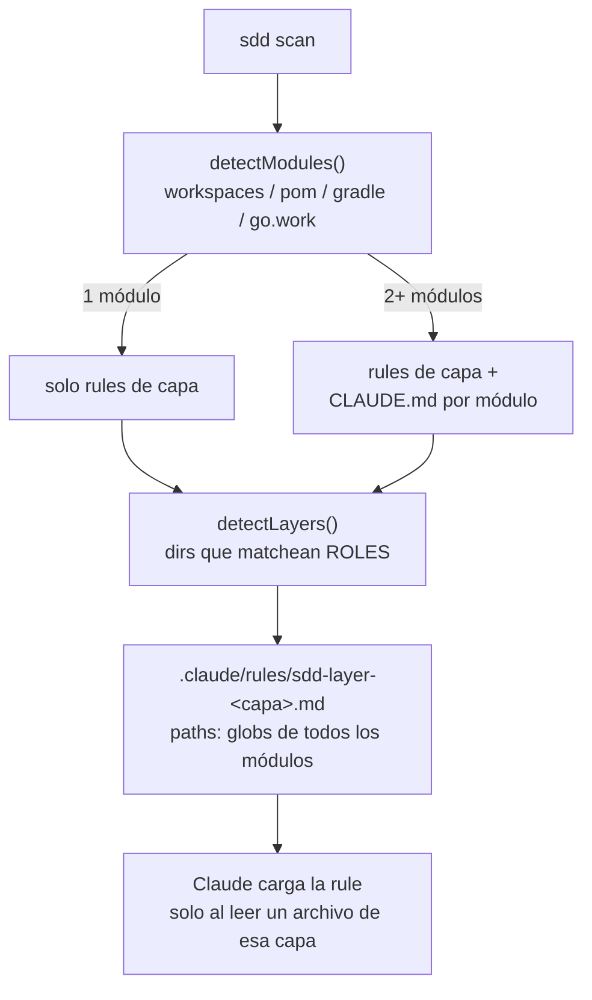

# Spec — tarea 019: convenciones por capa/módulo con progressive disclosure

> Presupuesto ≤ 300 palabras. El dev debe APROBARLO antes de planificar.

## Spec refinada

**Historia:** Como dev que usa sddkit en un repo grande o monorepo, quiero que las convenciones de cada capa y las responsabilidades de cada módulo se documenten donde el agente las carga solo al tocar esos archivos, para que el contexto de arranque quede chico y lo que se carga sea siempre relevante.

**Criterios de aceptación (formato EARS):**

- CUANDO se corre `sdd scan`, EL SISTEMA DEBE detectar los módulos del repo desde `package.json → workspaces`, `pnpm-workspace.yaml`, `<modules>` de `pom.xml`, `include` de `settings.gradle[.kts]` o `use` de `go.work` (BR-069).
- SI no se detecta ningún workspace, EL SISTEMA DEBE tratar el repo entero como un único módulo raíz `.` y no generar ningún `CLAUDE.md` anidado (BR-069, BR-073).
- CUANDO se corre `sdd scan`, EL SISTEMA DEBE detectar como capa todo directorio cuyo nombre esté en el mapa `ROLES`, a cualquier profundidad dentro de cada módulo (BR-070).
- CUANDO se detectan capas, EL SISTEMA DEBE escribir una rule `.claude/rules/sdd-layer-<capa>.md` por capa, con frontmatter `paths:` conteniendo los globs de esa capa en todos los módulos donde aparece (BR-071).
- CUANDO se escribe una rule de capa, EL SISTEMA DEBE incluir responsabilidad, dependencias permitidas marcadas `❓ VALIDAR` y una sección vacía de convenciones locales, referenciando el catálogo global en vez de copiarlo (BR-072).
- MIENTRAS el repo tenga 2+ módulos, EL SISTEMA DEBE mantener un `CLAUDE.md` en la raíz de cada módulo con su responsabilidad y las capas que contiene (BR-073).
- CUANDO se regenera un archivo ya existente de BR-071 o BR-073, EL SISTEMA DEBE pisar solo lo que está arriba de la marca manual y preservar intacto lo de abajo (BR-074).
- CUANDO se corre `sdd uninstall --repo`, EL SISTEMA DEBE borrar las rules `sdd-layer-*.md` y quitar el bloque gestionado de los `CLAUDE.md` de módulo, sin tocar rules ni contenido ajeno (BR-075).
- SI un glob de una rule `sdd-layer-*.md` no matchea ningún archivo, EL SISTEMA DEBE advertirlo en `sdd validate` como warning no bloqueante y sugerir `sdd scan` (BR-076).
- CUANDO se regenera el bloque gestionado de `CLAUDE.md`, EL SISTEMA DEBE declarar dónde viven las convenciones por capa y las responsabilidades por módulo (BR-077).

**Reglas de negocio afectadas:** BR-069 a BR-077 (nuevas, ya escritas en `.sdd/domain.md`). Preserva BR-032 (mirror de skills), BR-037 (generar-si-no-existe de los docs C4) y BR-060 (Claude como único target).

**Fuera de alcance:**

- Scope por capa en `.sdd/catalog.json` y en `sdd validate`: el catálogo sigue repo-wide (P2 del analysis).
- Paso interactivo para que el dev confirme el mapa de capas detectado (P3).
- Detectar capas por convención de framework más allá del nombre de directorio (anotaciones, decoradores).
- Rescribir los docs C4 existentes: `components.md` sigue siendo la vista global de módulos.

**Impacto en arquitectura/catálogo:** módulo nuevo `src/lib/layers.js` (detección de módulos y capas + render de rules), consumido por `src/commands/scan.js`; tocan también `src/lib/agentsmd.js` (BR-077), `src/commands/validate.js` (BR-076) y `src/commands/uninstall.js` (BR-075). El mapa `ROLES` de `src/lib/c4.js` pasa a exportarse y se amplía. Convenciones aplicables: `esm` (catálogo). Requiere **ADR-0015** documentando la elección del mecanismo híbrido (rules con `paths:` para capas + `CLAUDE.md` anidado para módulos) y por qué no se usó uno solo. `components.md` gana la vista por módulo → actualizar C4 en el mismo cambio.

### Diagrama

---
_Aprobación del dev: APROBADA (2026-08-05)_
