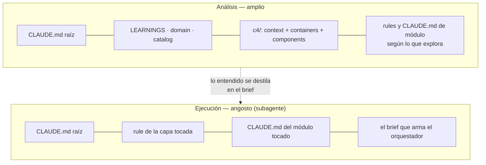

# Analysis — tarea 022: el C4 denso y cargado bajo demanda

> Tope: 45 líneas (BR-082). El dev debe APROBARLO antes de seguir.

## Entendimiento

El C4 está escrito para humanos (prosa) cuando su lector real es un agente, y se carga entero o nada. La evidencia externa apunta a lo contrario: documentos con rutas y símbolos reales, contexto **local por módulo** cargado bajo demanda, y precisión mantenida — lo que más daña es un doc desactualizado, no uno ausente ([Codified Context](https://arxiv.org/html/2602.20478v1), [Packmind](https://packmind.com/evaluate-context-ai-coding-agent/)).

Dos cambios: **(a)** `components.md` en formato máquina y como índice de módulos; **(b)** el detalle del nivel 3 baja al `CLAUDE.md` de cada módulo, que ya existe en monorepos (BR-073). _(La tercera mejora propuesta —chequeo de drift sin CLI— quedó fuera por H2.)_

La frontera con las rules de capa: **la capa dice cómo se escribe, el módulo qué hace y de quién depende.** Sin esa regla, `sdd-layer-<capa>.md` y `<módulo>/CLAUDE.md` terminan diciendo lo mismo.

Dato que salió al medir el flujo: `context.md` y `containers.md` **no los manda leer ninguna skill**. El dev ya decidió el destino — que `sdd-analyze` los lea — así que no se eliminan.

## Diagrama

## Huecos

- [x] **H1:** ¿Las rules por `paths:` y los `CLAUDE.md` anidados se cargan dentro de un subagente? — **Fuera de alcance:** el dev lo valida a mano con las herramientas de Claude. No es paso del plan.
- [x] **H2:** ¿Cómo se chequea el drift sin CLI? — **Postergado:** no preocupa por ahora. **Saca la tercera mejora del alcance de esta tarea.**
- [x] **H3:** En un repo de un solo módulo no hay `CLAUDE.md` anidado (BR-073), ¿el detalle del nivel 3 se queda en `components.md`? — **Sí.** Es el caso de sddkit mismo y no vale la pena inventarle un módulo.

---
_Aprobación del dev: aprobada 2026-08-14_
