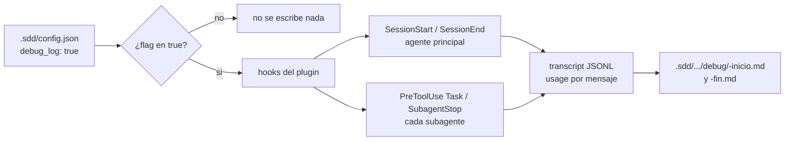

# Analysis — tarea 025: instrumentación de contexto por agente

## Entendimiento

Las tareas SDD gastan demasiados tokens y no sabemos en qué. Queremos medirlo: por cada agente que corre —el principal y cada subagente de `sdd-execute`— dos archivos de debug, uno al arrancar y otro al terminar, con el tamaño de su contexto y de qué está hecho. Solo si `.sdd/config.json` declara el flag de debug en `true`.

`/context` no es reproducible: es UI de la CLI, no una tool, y un subagente no tiene dispatcher de slash commands. El dato equivalente sale del transcript JSONL, cuya ruta reciben los hooks: en la primera llamada de un agente, `input_tokens + cache_creation + cache_read` es todo lo que se le mandó (system prompt + schemas de tools + memory + brief); la última llamada da el contexto de cierre, y la resta el crecimiento.

Eso da los **totales exactos**. El **desglose es aproximado** (opción elegida por el dev): medimos las piezas que componemos nosotros —el brief del paso, los archivos que le nombramos— y el resto queda como overhead fijo, medible una vez y restado.

Sin `SubagentStart` en la API de hooks: el "inicio" de un worker se captura en `PreToolUse` sobre `Task` (el brief que le mandamos) y el cierre en `SubagentStop`. Para el principal, `SessionStart` y `SessionEnd`.

ADR-0016 admite explícitamente este camino: scripts invocados desde hooks del plugin, nunca un CLI que el dev instale. Sin `jq` en la máquina; con `grep`/`sed`/`awk` alcanza, así que no se agrega ninguna runtime nueva y BR-079 queda intacta.

## Diagrama

## Huecos

- [x] **H1:** Nombre y lugar del flag. — _sugerido:_ `debug_log: true` en la raíz de `.sdd/config.json`, literal del pedido y greppable por el one-liner igual que `caveman`.
  - Respuesta: confirmado por el dev (2026-09-03).
- [x] **H2:** Dónde se escriben los archivos. — _sugerido:_ `.sdd/tasks/<id>/debug/` si hay tarea en `in-progress`; si no, `.sdd/debug/`. Nombre: `<agente>-<n>-inicio.md` / `-fin.md`.
  - Respuesta: confirmado por el dev (2026-09-03).
- [x] **H3:** ¿Van al repo o a `.gitignore`? — _sugerido:_ `.gitignore`: son diagnóstico de una corrida, ensucian el PR.
  - Respuesta: confirmado por el dev (2026-09-03).
- [x] **H4:** Qué entra en el desglose aproximado. — _sugerido:_ brief del paso y archivos que le nombramos, con bytes y tokens estimados; las salidas de tools no se ven desde el hook y quedan dentro del delta.
  - Respuesta: confirmado por el dev (2026-09-03).
- [x] **H5:** El "fin" del principal, ¿`Stop` o `SessionEnd`? — _sugerido:_ `SessionEnd`: `Stop` dispara en cada turno y generaría decenas de archivos por sesión.
  - Respuesta: confirmado por el dev (2026-09-03).

---
_Aprobación del dev: pendiente_
