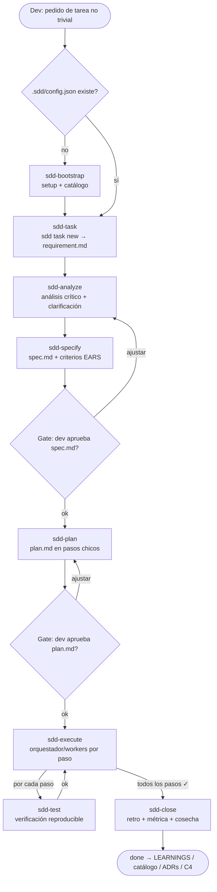

# sddkit

**Spec-driven development para agentes de IA.** Documentación C4 viva, catálogo de convenciones validadas y flujo SDD que se dispara solo — sin comandos manuales del dev. Multi-agente: Claude Code, Cursor y cualquier herramienta que lea AGENTS.md.

> v0.5 — prototipo. La versión exacta vive en package.json (`sdd` sin argumentos la muestra). Sin dependencias: solo necesita Node ≥ 18.

## Qué resuelve

Los agentes de código escriben código que funciona pero ignora tu arquitectura y tus convenciones. sddkit les da:

1. **Arquitectura C4 viva** (`.sdd/c4/`) — generada del código real, mantenida en cada cambio, con preguntas explícitas (❓ VALIDAR) que los agentes responden o te preguntan.
2. **Catálogo de convenciones** — si hay 3 formas de escribir endpoints en tu repo, sddkit las detecta, vos elegís la canónica, y todos los agentes la respetan. El código legacy queda como deuda tolerada que solo puede bajar (ratchet).
3. **Flujo SDD por tarea con artefactos persistentes** — para cada tarea no trivial el agente crea `.sdd/tasks/<id>/` con el requisito original verbatim, la spec refinada (preguntas de clarificación + criterios EARS, con aprobación del dev) y un plan en pasos chicos trackeables. Se puede pausar y retomar en otra sesión (`sdd task show <id>` indica el próximo paso), y cada paso lleva un hint de modelo (`económico`/`potente`) para que el agente delegue lo mecánico a un modelo barato. Inspirado en GitHub Spec Kit y Kiro.
4. **Check de drift** — `sdd validate` falla (exit 1) si el código diverge de las docs o alguien viola el catálogo. Listo para CI o pre-commit.

## Instalación

```bash
# Opción A: clonar/copiar la carpeta y usar node directo
node /ruta/a/sddkit/bin/sdd.js <comando>

# Opción B: npm link (crea el comando global `sdd`)
cd /ruta/a/sddkit && npm link
```

En Windows: `node C:\ruta\a\sddkit\bin\sdd.js <comando>` desde la raíz de tu repo.

## Uso

```bash
cd tu-repo
sdd setup
```

Es la **única entrada**. La primera vez en tu máquina instala además la skill global de Claude Code: los próximos repos ya no necesitan ningún comando — el agente detecta que no están configurados y ofrece configurarlos solo. En el repo: detecta tu entorno, instala sin pisar nada, escanea, instala el pre-commit hook y te pregunta las convenciones (elegís un número).

El dev no necesita más comandos. `scan`, `decide` y `validate` existen como comandos individuales pero los usan los agentes y el pre-commit hook, no las personas. `validate` corre automáticamente en cada commit (opt-out: `.sdd/config.json` → `"hooks": {"preCommit": false}`).

### `setup` — el único comando

- **Desde cero:** instala AGENTS.md, skill de Claude Code y config.
- **Entorno existente:** modo merge — detecta CLAUDE.md, AGENTS.md, skills, rules de Cursor, instrucciones de Copilot, etc. No sobreescribe nada, agrega bloques gestionados delimitados, lista tus skills previas para revisar solapamientos.

### `scan` — el repo como fuente de verdad

Genera `.sdd/c4/context.md`, `containers.md` y `components.md` con diagramas Mermaid C4, detecta stack, frameworks y data stores, y lista los topics donde tu repo tiene más de un estilo conviviendo. Las secciones manuales de los docs (debajo de la marca `sdd:manual`) se preservan en cada regeneración.

### El catálogo — sin fricción para el dev

Las decisiones se toman eligiendo una opción: en el wizard de `setup` (terminal) o cuando el agente detecta un conflicto y pregunta en el chat. El agente registra la elección él mismo (`sdd decide`). Las variantes no elegidas quedan como baseline de deuda legacy: no se migra salvo pedido explícito, pero **nunca** se escribe código nuevo con ellas.

### `validate` — el contrato (automático)

Corre solo en cada commit via pre-commit hook instalado por `setup`. Falla si una variante no canónica creció sobre su baseline, advierte drift entre docs y repo. `--update` ajusta la deuda hacia abajo cuando migrás legacy (ratchet). Opt-out por repo en `.sdd/config.json`.

### `sync` — actualizar un repo ya configurado

Después de actualizar el paquete `sddkit` (`npm update`, nueva versión instalada), corré `sdd sync` para traer el config, AGENTS.md, skills y hooks a la versión instalada. No escanea ni dispara el wizard de convenciones — asume que tu repo ya está configurado. El comando muestra un resumen: si tu config ya coincidía con la versión del CLI, dice que estás al día; si no, muestra la transición `vANTERIOR → vNUEVA`. Si tus skills están en scope global, advierte que se actualizaron las skills globales (`~/.claude/skills/sdd-*`), compartidas por todos tus repos.

**No hace:** no instala la skill global `sdd-bootstrap` (exclusiva de `sdd setup`), no corre `scan` ni el wizard de convenciones (`decide`).

## Grafo de impacto

Un grafo central y opcional que conecta los endpoints que expone cada repo con quién los consume — para responder **¿a quién impacto si cambio esto?** (BR-014). Desde esta versión, `sdd setup` activa automáticamente `graph.driver: "sqlite"` (ruta configurable, default `~/.sddkit/graph.db`, BR-035), así que el grafo queda funcionando sin pasos manuales. El modo "degrada en silencio" (`sdd publish` y `sdd impact` muestran una advertencia y no hacen nada, `sdd context` no muestra nada distinto) solo aplica a repos que no corrieron `sdd setup` con esta versión, o que tienen un `.sdd/config.json` editado a mano sin clave `"graph"`.

**Configuración:** normalmente no hace falta tocar esto a mano — `sdd setup` ya lo configura (SQLite, con la ruta que elegiste o el default). Esta sección queda como referencia para entender qué generó `sdd setup`, cambiar a MySQL manualmente (BR-015, sigue sin wizard) o ajustar el path de SQLite después. La clave `"graph"` en `.sdd/config.json` admite uno de estos drivers:

- **SQLite local** (default):
  ```json
  {
    "graph": {
      "driver": "sqlite",
      "sqlite": { "path": "~/.sddkit/graph.db" }
    }
  }
  ```
  Omitir `"sqlite"` usa el default.

- **MySQL compartido por el equipo:**
  ```json
  {
    "graph": {
      "driver": "mysql",
      "mysql": { "urlEnv": "SDDKIT_GRAPH_DB_URL" }
    }
  }
  ```
  La connection string se lee de la variable de entorno indicada, nunca va literal en el config versionado (BR-015).

**Comandos:**

- **`sdd publish`** — sube un snapshot del repo actual (arquitectura C1, endpoints, consumos detectados, hash de commit + timestamp) al grafo. Rechaza si quedan preguntas sin responder en `.sdd/c4/`.
- **`sdd impact <MÉTODO> <ruta>`**, **`sdd impact <sistema>`** o **`sdd impact <ARN-o-nombre-de-recurso>`** — ¿quién consume esto? Las dos primeras formas reportan sistemas consumidores con nivel de confianza `exacto`/`posible` (BR-014). La 3ra forma busca el argumento entre los recursos de infraestructura publicados (`infraResources`/`infraEdges`) y reporta las aristas que lo mencionan, con su `type` y `confidence` (`confirmado`/`potencial`) (BR-021). Si ninguna de las 3 interpretaciones matchea, lo informa explícitamente. Informativo, nunca bloquea (ADR-0004).
- **`sdd context`** — si el repo está publicado, muestra fecha y hash del último `sdd publish`; si no, sugiere correrlo.

**Scanner de infraestructura (opcional, Fase 3):** corré `terraform show -json > show.json` en el repo de infraestructura (fuera de sddkit) y luego `sdd scan --terraform=show.json` (BR-017) — detecta recursos compartibles (S3/SQS/SNS/DynamoDB/RDS/EventBridge) y aristas entre ellos (cableados de eventos, bindings IAM) a partir SOLO de metadatos, nunca de `values` (ADR-0005). `sdd publish` sube esos recursos/aristas al grafo (BR-020), habilitando `sdd impact <ARN-o-nombre-de-recurso>` (BR-021). Límite conocido (BR-022): esto agrega aristas NUEVAS infra↔infra/IAM, pero no mejora la confianza `posible`→`exacto` de los matches HTTP existentes.

**Integración en CI (ejemplo):**

```yaml
# .github/workflows/sdd-publish.yml
name: sdd publish
on:
  push:
    branches: [main]
jobs:
  publish:
    runs-on: ubuntu-latest
    steps:
      - uses: actions/checkout@v4
      - uses: actions/setup-node@v4
        with:
          node-version: 20
      - run: npm ci
      - run: npx sdd publish
        env:
          SDDKIT_GRAPH_DB_URL: ${{ secrets.SDDKIT_GRAPH_DB_URL }}
```

(Este snippet es documentación/ejemplo — no se aplica a CI real en esta tarea.)

**Auto-publish local (SQLite) vs CI (MySQL):**

Con `"graph": { "driver": "sqlite" }`, `sdd setup`/`sdd init` instalan automáticamente un hook post-commit que ejecuta `sdd publish --hook` tras cada commit — sin mensajes salvo confirmación de éxito (`✓ grafo local actualizado (sqlite) → commit <hash> @ <timestamp>`). Esto mantiene el snapshot del grafo siempre sincronizado con tu arquitectura local, sin requerir comandos manuales. El hook puede desactivarse agregando `"hooks": { "autoPublish": false }` a `.sdd/config.json` (es `true` por default cuando el driver es SQLite). Con `"graph": { "driver": "mysql" }`, el comportamiento no cambia — el hook post-commit no hace nada, y la publicación sigue el flujo de CI sobre la rama `main` descrito en ADR-0003.

## Cómo lo ven los agentes

- **Claude Code**: 8 skills con estructura (una carpeta por fase: SKILL.md + templates + ejemplos + referencias): `sdd-task` (router, auto-trigger), `sdd-analyze`, `sdd-specify`, `sdd-plan`, `sdd-execute`, `sdd-test` (tests reproducibles via script + Docker), `sdd-close` y `sdd-bootstrap` (global). Instalación **local** (el repo, versionadas en git) o **global** (toda la máquina) — lo elegís en `sdd setup` (o flags `--local`/`--global`).
- **Cursor**: rule `sdd.mdc` con `alwaysApply: true`.
- **Todos los demás** (Copilot, Codex, Devin, etc.): bloque gestionado en `AGENTS.md`, el estándar que ya leen.

## Flujo SDD: secuencia de skills

Así se encadenan las skills de Claude Code para una tarea no trivial, desde el pedido del dev hasta el cierre:



- **sdd-bootstrap** es global y solo entra en juego si el repo todavía no tiene `.sdd/config.json` (lo configura una vez y listo).
- Los dos **gates** (spec y plan) son del dev: sin su aprobación explícita, el flujo no avanza al paso siguiente.
- **sdd-test** es transversal: `sdd-execute` lo invoca para verificar cada paso, y `sdd-close` lo corre antes del cierre.
- Lo que **sdd-close** cosecha (LEARNINGS, catálogo, ADRs, C4) retroalimenta `sdd context`, que leen `sdd-analyze` y `sdd-plan` en futuras tareas.

## Estructura que crea en tu repo

```
.sdd/
  config.json      # metadata + switches (hooks)
  catalog.json     # decisiones de convenciones (versionable, code-reviewable)
  patterns.json    # variantes detectadas, pendientes de decisión
  QUESTIONS.md     # preguntas abiertas + fuentes de documentación existente
  tasks/
    index.json     # estado y progreso de cada tarea SDD
    <id>-<slug>/
      requirement.md  # el pedido original del dev, verbatim (no se edita)
      spec.md         # análisis + clarificaciones + spec refinada (criterios EARS)
      plan.md         # pasos chicos: archivos, dependencias, modelo, verificación
  c4/
    context.md     # C4 nivel 1 + preguntas ❓ VALIDAR
    containers.md  # C4 nivel 2
    components.md  # C4 nivel 3
AGENTS.md          # bloque gestionado (tu contenido nunca se toca)
.claude/skills/sdd-*/                  # las skills SDD (si elegiste alcance local)
.cursor/rules/sdd.mdc                  # si usás Cursor
```

## Cómo probarlo

1. **Setup en un repo real**: `cd tu-repo && sdd setup`. Detecta tu entorno (CLAUDE.md, skills, rules existentes) sin pisar nada, escanea, instala el pre-commit hook y te pregunta las convenciones encontradas (Enter = la más usada).
2. **Diagramas C4**: abrí `.sdd/c4/*.md` — son Mermaid `flowchart`, GitHub/GitLab los renderizan solos en el preview; en IntelliJ instalá el plugin "Mermaid". Revisá que el mapa refleje tu arquitectura real y que las preguntas `❓ VALIDAR` tengan sentido.
3. **Enforcement automático**: `git commit` corre `sdd validate` solo. Creá un archivo con la variante NO canónica del topic que elegiste → el commit debe fallar (exit 1) señalando el archivo; borralo y vuelve a pasar.
4. **El agente lo respeta**: abrí Claude Code (o Cursor) y pedile algo real sin mencionar sddkit (ej: "agregá un endpoint para listar X"). Debería leer `.sdd/`/AGENTS.md, usar la variante canónica del catálogo y disparar el flujo SDD (spec → plan → ejecución) por su cuenta.
5. **Regeneración no destructiva**: escribí una nota debajo de la marca `sdd:manual` en `.sdd/c4/context.md`, corré `sdd scan` de nuevo y verificá que tu nota sobrevivió.
6. **Bootstrap automático**: abrí Claude Code en otro repo sin sddkit configurado y pedile cualquier tarea — debería detectar que falta, ofrecerte configurarlo y correr `sdd setup --agent` solo.

## Desinstalar

```bash
sdd uninstall              # borra solo la skill global de tu máquina; los repos quedan intactos
sdd uninstall --repo       # además limpia el repo actual (pide confirmación)
npm rm -g sddkit           # borra el comando sdd (npm unlink si usaste npm link)
```

`--repo` quita exactamente lo que sddkit instaló: `.sdd/`, la skill del repo, la rule de Cursor, el bloque gestionado de AGENTS.md (tu contenido propio sobrevive), la línea de CLAUDE.md y la línea del pre-commit (el hook solo se borra entero si era 100% de sddkit). Si `.sdd/` estaba commiteado, queda recuperable en el historial de git.

## Seguridad

sddkit ejecuta comandos shell definidos en archivos del repo. Concretamente: las líneas `Verificación: cmd: <comando>` de `.sdd/tasks/<id>/plan.md` se ejecutan cuando corrés `sdd task verify <id> <paso>`, y el `git checkout -b <rama>` del Paso 1 del plan se ejecuta en `sdd task execute <id>`.

Esto es **por diseño** — es la feature de verificación ejecutable del flujo SDD — y es el mismo modelo de confianza que `make`, los `scripts` de `npm` o un `Makefile`: el contenido del repo se ejecuta con tus permisos. Por eso, **corré sddkit solo sobre repos en los que confiás**; si clonás un repo ajeno, revisá sus `.sdd/tasks/**/plan.md` antes de correr `sdd task verify`/`execute`.

Para reportar una vulnerabilidad, ver [`SECURITY.md`](SECURITY.md).

## Licencia

MIT (provisional — pendiente de decisión final).
