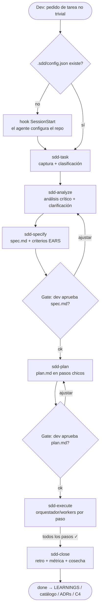

# sddkit

[](LICENSE)

**Spec-driven development para Claude Code.** Documentación C4 viva, catálogo de convenciones validadas y flujo SDD que se dispara solo — sin comandos manuales del dev.

> Prototipo. Se instala como **plugin de Claude Code**: es markdown y JSON, no requiere Node ni ninguna otra runtime, y no hay nada que ejecutar (ADR-0016).

## Qué resuelve

Los agentes de código escriben código que funciona pero ignora tu arquitectura y tus convenciones. sddkit les da:

1. **Arquitectura C4 viva** (`.sdd/c4/`) — derivada del código real, mantenida en cada cambio, con preguntas explícitas (❓ VALIDAR) que el agente responde o te pregunta.
2. **Catálogo de convenciones** — si hay 3 formas de escribir endpoints en tu repo, el agente las detecta, vos elegís la canónica, y todos los agentes la respetan. El código legacy queda como deuda tolerada que solo puede bajar (ratchet).
3. **Flujo SDD por tarea con artefactos persistentes** — para cada tarea no trivial el agente crea `.sdd/tasks/<id>/` con el requisito original verbatim, la spec refinada (preguntas de clarificación + criterios EARS, con aprobación del dev) y un plan en pasos chicos trackeables. Se puede pausar y retomar en otra sesión, y cada paso lleva un hint de modelo (`rapido`/`medio`/`fuerte`) para delegar lo mecánico a un modelo barato. Inspirado en GitHub Spec Kit y Kiro.
4. **Reglas de negocio y decisiones citables** — BR-NNN en `.sdd/domain.md` y ADRs en `.sdd/decisions/`, vinculantes para el agente.

## Instalación

En Claude Code:

```
/plugin marketplace add ezepaskana/sddkit
/plugin install sddkit@sddkit
```

Eso es todo. **No hay más pasos**: no se instala nada en tu repo, no hay comando que correr, no hay hooks de git que aceptar. La próxima vez que abras una sesión en un repo sin configurar, el agente lo detecta y te ofrece configurarlo, preguntándote solo lo que no puede deducir del código.

## Cómo se usa

No se usa: se conversa. Pedile al agente lo que necesites y el flujo se dispara solo.

- **Pedido de cambio** ("agregá X", "arreglá Y", "refactorizá Z") → arranca el flujo SDD: captura del requisito, análisis, spec, plan y ejecución, con un gate tuyo entre artefactos.
- **Pregunta** ("¿cómo funciona X?", "¿por qué falla Y?") → análisis read-only, sin tocar código, con la investigación persistida en `.sdd/notes/`.

Los **gates** son tuyos: el agente te muestra el artefacto y espera tu aprobación explícita antes de seguir. Sin CLI que los fuerce, el gate es el propio agente siguiendo las skills.

## Cómo está hecho

| Carpeta | Qué es |
|---|---|
| `.claude-plugin/` | manifiesto del plugin y marketplace propio |
| `skills/` | las 7 skills `sdd-*`: el comportamiento que el agente lee en cada fase |
| `hooks/` | el único disparo automático: un `SessionStart` que detecta un repo sin configurar |

Las skills son `sdd-task` (router, auto-trigger), `sdd-analyze`, `sdd-specify`, `sdd-plan`, `sdd-execute`, `sdd-close` y `sdd-improve-skill`. Cada una es una carpeta con `SKILL.md` + `references/`, `templates/` y `examples/`, para que el agente cargue solo lo que necesita.

## Flujo SDD: secuencia de skills


```mermaid
flowchart TD
  start(["Dev: pedido de tarea no trivial"]) --> boot{".sdd/config.json existe?"}
  boot -- no --> hook["hook SessionStart<br/>el agente configura el repo"]
  hook --> task
  boot -- sí --> task["sdd-task<br/>captura + clasificación"]

  task --> analyze["sdd-analyze<br/>análisis crítico + clarificación"]
  analyze --> specify["sdd-specify<br/>spec.md + criterios EARS"]
  specify --> gateSpec{"Gate: dev aprueba spec.md?"}
  gateSpec -- ajustar --> analyze
  gateSpec -- ok --> plan["sdd-plan<br/>plan.md en pasos chicos"]
  plan --> gatePlan{"Gate: dev aprueba plan.md?"}
  gatePlan -- ajustar --> plan
  gatePlan -- ok --> execute["sdd-execute<br/>orquestador/workers por paso"]

  execute -- "todos los pasos ✓" --> close["sdd-close<br/>retro + métrica + cosecha"]
  close --> done(["done → LEARNINGS / catálogo / ADRs / C4"])
```

- El **tipo** de tarea (`simple`/`bug`/`feature`/`refactor`) decide qué fases se recorren: una tarea simple no escribe spec.
- Cada paso del plan lleva una **verificación ejecutable** (`cmd: <comando>`) que el orquestador corre antes de marcar el checkbox — el reporte del subagente es un claim, no una prueba.
- Lo que **sdd-close** cosecha (LEARNINGS, catálogo, ADRs, C4) alimenta el contexto de las tareas siguientes.

## Estructura que crea en tu repo

```
.sdd/
  config.json      # metadata + preferencias (opener, modelos)
  catalog.json     # decisiones de convenciones (versionable, code-reviewable)
  patterns.json    # variantes detectadas, pendientes de decisión
  QUESTIONS.md     # preguntas abiertas + fuentes de documentación existente
  LEARNINGS.md     # aprendizajes cosechados al cerrar cada tarea
  branching.md     # política de ramas y convención de commits (versionada)
  domain.md        # glosario, entidades y reglas de negocio BR-NNN (vinculantes)
  decisions/       # ADRs numerados (no se contradice uno aceptado sin ADR nuevo)
  notes/           # investigaciones standalone (read-only, retomables)
  tasks/
    index.json     # estado y progreso de cada tarea SDD
    <id>-<slug>/
      requirement.md  # el pedido original del dev, verbatim (no se edita)
      analysis.md     # análisis crítico + clarificaciones (feature/refactor)
      spec.md         # spec refinada con criterios EARS (feature)
      plan.md         # pasos chicos: archivos, dependencias, modelo, verificación
      retro.md        # retro y métrica al cerrar
  c4/
    context.md     # C4 nivel 1 + preguntas ❓ VALIDAR
    containers.md  # C4 nivel 2
    components.md  # C4 nivel 3
CLAUDE.md          # bloque gestionado (tu contenido nunca se toca)
.claude/rules/sdd-layer-<capa>.md      # convenciones por capa (carga bajo demanda)
<módulo>/CLAUDE.md                     # responsabilidad de cada módulo (solo monorepo)
```

### Documentación que se carga sola (progressive disclosure)

El bloque de `CLAUDE.md` de la raíz se lee en cada sesión, así que solo lleva lo transversal. Lo específico se escribe aparte y Claude Code lo carga **solo cuando toca esos archivos** (ADR-0015):

- **Por capa** — el agente detecta los directorios de capa (controllers, services, repositories… a cualquier profundidad) y escribe una rule por capa en `.claude/rules/sdd-layer-<capa>.md`, con un frontmatter `paths:` que lista los globs de esa capa **en todos los módulos** donde aparece. Cada rule trae responsabilidad, dependencias permitidas (marcadas `❓ VALIDAR`) y un hueco para tus convenciones locales.
- **Por módulo** — en un monorepo (npm/pnpm workspaces, Maven, Gradle, `go.work`), cada módulo recibe un `CLAUDE.md` en su raíz con su responsabilidad, las capas que contiene y su relación con los otros módulos.

Ambos se actualizan de forma quirúrgica: se toca lo que tiene que seguir al código y se preserva todo lo que escribas (BR-074).

## Cómo probarlo

1. **Repo nuevo**: abrí Claude Code en un repo sin `.sdd/` y pedile cualquier tarea. Debería detectar que falta la configuración y ofrecerte generarla, sin que tipees ningún comando.
2. **Diagramas C4**: abrí `.sdd/c4/*.md` — son Mermaid `flowchart`, GitHub/GitLab los renderizan en el preview; en IntelliJ instalá el plugin "Mermaid". Revisá que el mapa refleje tu arquitectura real.
3. **El agente lo respeta**: pedile algo real sin mencionar sddkit (ej: "agregá un endpoint para listar X"). Debería leer `.sdd/`, usar la variante canónica del catálogo y disparar el flujo SDD por su cuenta.
4. **Retomar entre sesiones**: cortá una tarea a la mitad y volvé en otra sesión — debería ubicar el primer paso sin marcar del plan y seguir desde ahí.

## Desinstalar

```
/plugin uninstall sddkit@sddkit
```

Desinstalar el plugin **no toca tus repos**: el `.sdd/` que generó es tuyo, está versionado en git y queda como documentación. Si además querés limpiarlo, borrá `.sdd/`, las rules `.claude/rules/sdd-layer-*.md` y el bloque gestionado de `CLAUDE.md` (tu contenido propio está fuera del bloque).

## Seguridad

sddkit hace que el agente ejecute comandos definidos en archivos del repo: las líneas `Verificación: cmd: <comando>` de `.sdd/tasks/<id>/plan.md` se corren para verificar cada paso, y el `git checkout -b <rama>` del Paso 1 del plan se ejecuta al arrancar la ejecución.

Esto es **por diseño** — es la feature de verificación ejecutable del flujo SDD — y es el mismo modelo de confianza que `make` o los `scripts` de `npm`: el contenido del repo se ejecuta con tus permisos, mediados por los permisos de Claude Code. Por eso, **usá sddkit solo sobre repos en los que confiás**; si clonás un repo ajeno, revisá sus `.sdd/tasks/**/plan.md` antes de dejar que el agente ejecute un plan.

Para reportar una vulnerabilidad, ver [`SECURITY.md`](SECURITY.md).

## Licencia

MIT — ver [LICENSE](LICENSE).
