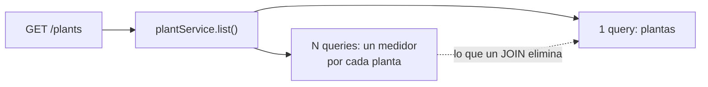

# Ejemplo de analysis (nivel de profundidad esperado — 24 líneas)

**Requisito:** _"agregar un cache Redis para el endpoint de plantas porque está lento"_. Tipo `feature`, riesgo alto (dependencia nueva).

## Entendimiento

GET /plants tarda ~2s y el dev lo atribuye al volumen de lectura. Pero `plantService.list()` (`src/services/plantService.js:41`) hace **N+1 queries**, una por medidor: con 200 plantas, eso explica la latencia entera. Un JOIN la elimina sin sumar dependencia, invalidación ni deploy.

Además, cachear datos de facturación choca con BR-003: facturación usa siempre la última medición.

## Diagrama

## Huecos

- [ ] **H1:** El N+1 explica los 2s completos, así que el cache sobraría. ¿Arreglo el N+1 y medimos antes de decidir sobre Redis? — _sugerido: sí; si después de medir sigue lento, el cache va con ADR propio._
  - Respuesta: …

---

**Qué mirar:** el entendimiento **contradice al dev** con evidencia (`archivo:línea`), no lo complace — pero lo hace como un hueco con respuesta sugerida, no como una sección de objeciones. El diagrama muestra lo mismo que el texto, no algo adicional. Un solo hueco alcanza: los otros cuatro no harían falta.
